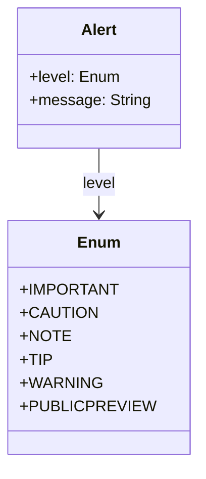

# Alert

Alerts are a Markdown extension to create block quotes that render on Microsoft Learn with colors and icons that indicate the significance of the content.

Alerts include:
- [caution](#caution)
- [important](#important)
- [note](#note)
- [public-preview](#public-preview)
- [tip](#tip)
- [warning](#warning)

## Diagram

The following diagram displays the set of possible sub-elements of the component.



## Example markdown

The following markdown is an example of the artifact in a file.

```md
  > [!CAUTION]
  > Negative potential consequences of an action.
```

## JSON parsed object

The following JSON represents the attributes of a parsed artifact.

```json

{
    "type": "alert",
    "id": "guid",
    "attributes": [
        {
            "category": "Caution"
        },
        {
            "markdown": "markdown"
        },
        {
            "text": "text-only"
        }
    ],
    "child": []
}

```

## JSON Schema for a parsed object

A JSON Schema provides a contract for the JSON data required by a given application and how that JSON data should be structured. It describes the structure of the JSON data, specifying what properties are required, the types of values, and more.

```json
{
    "$schema": "http://json-schema.org/draft-07/schema#",
    "type": "object",
    "required": ["type", "id", "attributes", "child"],
    "properties": {
        "type": {
            "type": "string",
            "enum": ["alert"]
        },
        "id": {
            "type": "string",
            "pattern": "^[a-zA-Z0-9-]+$"
        },
        "attributes": {
            "type": "array",
            "items": {
                "type": "object",
                "minProperties": 1,
                "properties": {
                    "category": {
                        "type": "string",
                        "enum": ["IMPORTANT", "CAUTION", "NOTE", "TIP", "WARNING", "PUBLICPREVIEW"]
                    },
                    "markdown": {
                        "type": "string"
                    },
                    "text": {
                        "type": "string"
                    }
                }
            }
        },
        "child": {
            "type": "array",
            "items": {
                "type": "object"
            }
        }
    },
    "additionalProperties": false
}
```

## caution

Negative potential consequences of an action.

```md
  > [!CAUTION]
  > Negative potential consequences of an action.
```

## important

Essential information required for user success.

```markdown
  > [!IMPORTANT]
  > Essential information required for user success.

```
## note

Information the user should notice even if skimming.

```markdown
  > [!NOTE]
  > Information the user should notice even if skimming.

```

## public-preview

Definition

```markdown


```

## tip

Optional information to help a user be more successful.

```markdown
  > [!TIP]
  > Optional information to help a user be more successful.

```

## warning

Definition

```markdown
  > [!WARNING]
  > Dangerous certain consequences of an action.
```

## More components

[Library of components](document-object-model.md#library-of-defined-components-in-the-ca-object-model)