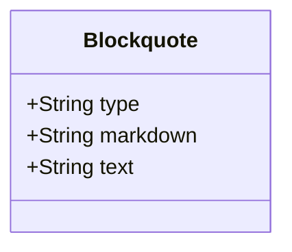

# Blockquote

A blockquote is used to indicate a section of text that is a quotation from another source. It visually sets the quoted text apart from the main content, making it easy for readers to recognize that the text is a quote.

## Diagram

The following diagram displays the set of possible sub-elements of the component.



## Example markdown

The following markdown is an example of the artifact in a file.

```md
  > This is the text.
  > This is the second line of text.
  > This is the third line of text.
```

## JSON parsed object

The following JSON represents the attributes of a parsed artifact.

```json
{
    "type": "blockquote",
    "markdown": "  > This is the text.\r\n  > This is the second line of text.\r\n  > This is the third line of text.",
    "text": "This is the text.\r\nThis is the second line of text.\r\nThis is the third line of text."
}
```

## JSON Schema for a parsed object

A JSON Schema provides a contract for the JSON data required by a given application and how that JSON data should be structured. It describes the structure of the JSON data, specifying what properties are required, the types of values, and more.

```json
{
  "$schema": "http://json-schema.org/draft-07/schema#",
  "type": "object",
  "properties": {
    "type": {
      "type": "string"
    },
    "markdown": {
      "type": "string"
    },
    "text": {
      "type": "string"
    }
  },
  "required": [
    "type",
    "markdown",
    "text"
  ]
}


```

## More components

[Library of components](document-object-model.md#library-of-defined-components-in-the-ca-object-model)