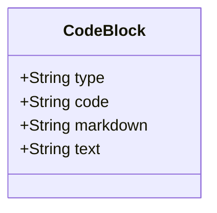
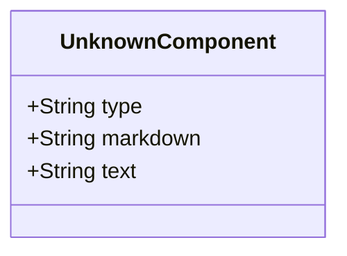

# Code-block

A Markdown code block is a section of text used to display code, commands, or other preformatted text. Unlike inline code, which is delimited by single backticks (`), a code block is delimited by triple backticks (```) or indented with four spaces. This ensures the content inside is displayed in a monospace font and is not processed as regular Markdown, preserving whitespace and special characters.

## Diagram

The following diagram displays the set of possible sub-elements of the component.



## Example markdown

The following markdown is an example of the artifact in a file.

```md
    ```python
    def owl_to_json_schema(owl_filename, output_filename):
        g = Graph()
        g.parse(owl_filename, format="xml")
    
        # Define a simple JSON Schema template
        json_schema = {
            "$schema": "http://json-schema.org/draft-07/schema#",
            "type": "content-object",
            "properties": {}
        }
    
        # Iterate through all triples in the graph and look for "how-to" object
        for subj, pred, obj in g:
            if "how-to" in subj:
                # Add properties to JSON Schema (This is just an example, modify as needed)
                json_schema["properties"][str(pred)] = {"type": "string", "description": str(obj)}
    
        # Save JSON Schema to output file
        with open(output_filename, 'w') as f:
            json.dump(json_schema, f, indent=2)
    ```
```

## JSON parsed object

The following JSON represents the attributes of a parsed artifact.

```json
{
    "type": "code-block",
    "code": "python",
    "markdown": "```python\r\ndef owl_to_json_schema(owl_filename, output_filename):\r\n    g = Graph()\r\n    g.parse(owl_filename, format=\"xml\")\r\n\r\n    # Define a simple JSON Schema template\r\n    json_schema = {\r\n        \"$schema\": \"http:\/\/json-schema.org\/draft-07\/schema#\",\r\n        \"type\": \"content-object\",\r\n        \"properties\": {}\r\n    }\r\n\r\n    # Iterate through all triples in the graph and look for \"how-to\" object\r\n    for subj, pred, obj in g:\r\n        if \"how-to\" in subj:\r\n            # Add properties to JSON Schema (This is just an example, modify as needed)\r\n            json_schema[\"properties\"][str(pred)] = {\"type\": \"string\", \"description\": str(obj)}\r\n\r\n    # Save JSON Schema to output file\r\n    with open(output_filename, 'w') as f:\r\n        json.dump(json_schema, f, indent=2)\r\n```",
    "text": "def owl_to_json_schema(owl_filename, output_filename):\r\n    g = Graph()\r\n    g.parse(owl_filename, format=\"xml\")\r\n\r\n    # Define a simple JSON Schema template\r\n    json_schema = {\r\n        \"$schema\": \"http:\/\/json-schema.org\/draft-07\/schema#\",\r\n        \"type\": \"content-object\",\r\n        \"properties\": {}\r\n    }\r\n\r\n    # Iterate through all triples in the graph and look for \"how-to\" object\r\n    for subj, pred, obj in g:\r\n        if \"how-to\" in subj:\r\n            # Add properties to JSON Schema (This is just an example, modify as needed)\r\n            json_schema[\"properties\"][str(pred)] = {\"type\": \"string\", \"description\": str(obj)}\r\n\r\n    # Save JSON Schema to output file\r\n    with open(output_filename, 'w') as f:\r\n        json.dump(json_schema, f, indent=2)"
}
```

## JSON Schema for a parsed object

A JSON Schema provides a contract for the JSON data required by a given application and how that JSON data should be structured. It describes the structure of the JSON data, specifying what properties are required, the types of values, and more.

```json
{
  "$schema": "http://json-schema.org/draft-04/schema#",
  "type": "object",
  "properties": {
    "type": {
      "type": "string"
    },
    "code": {
      "type": "string"
    },
    "markdown": {
      "type": "string"
    },
    "text": {
      "type": "string"
    }
  },
  "required": [
    "type",
    "code",
    "markdown",
    "text"
  ]
}

```


# component-unknown

A container for components that an inventory process can't identify as a defined component.

## Diagram

The following diagram displays the set of possible sub-elements of the component.



## Example markdown

The following markdown is an example of the artifact in a file.

```md
{{unknown markdown construct}}
```

## JSON parsed object

The following JSON represents the attributes of a parsed artifact.

```json
{
    "type": "component-unknown",
    "markdown": "markdown",
    "text": "text-only"
}
```

## JSON Schema for a parsed object

A JSON Schema provides a contract for the JSON data required by a given application and how that JSON data should be structured. It describes the structure of the JSON data, specifying what properties are required, the types of values, and more.

```json
{
  "$schema": "http://json-schema.org/draft-04/schema#",
  "type": "object",
  "properties": {
    "type": {
      "type": "string"
    },
    "markdown": {
      "type": "string"
    },
    "text": {
      "type": "string"
    }
  },
  "required": [
    "type",
    "markdown",
    "text"
  ]
}

```


