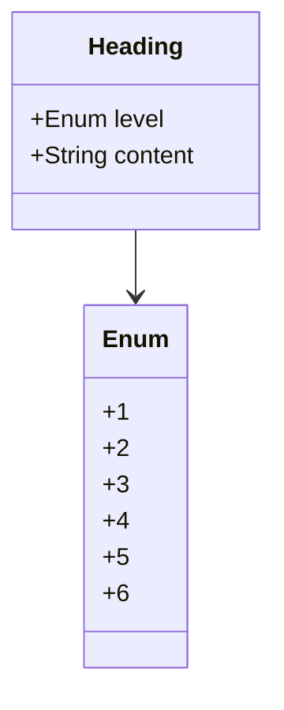

# header

Heading elements are used to define headings in HTML. They range from` <h1>` to` <h6>`, with `<h1> `representing the highest (or most important) level and `<h6>` the lowest (or least important) level.

## Diagram

The following diagram displays the set of possible sub-elements of the component.



## Example markdown

The following markdown is an example of the artifact in a file.

```md
# Heading
```

## JSON parsed object

The following JSON represents the attributes of a parsed artifact.

```json
{
    "type": "header",
    "level": "1"
    "markdown": "# Title text for the header",
    "text": "Title text for the header"
}
```

## JSON Schema for a parsed object

A JSON Schema provides a contract for the JSON data required by a given application and how that JSON data should be structured. It describes the structure of the JSON data, specifying what properties are required, the types of values, and more.

```json
{
  "$schema": "http://json-schema.org/draft-07/schema#",
  "title": "Header",
  "description": "Schema for a header object",
  "type": "object",
  "properties": {
    "type": {
      "type": "string",
      "description": "The type of the object.",
      "enum": ["header"]
    },
    "level": {
      "type": "string",
      "description": "The level of the header.",
      "enum": ["1", "2", "3", "4", "5", "6"]
    },
    "markdown": {
      "type": "string",
      "description": "The markdown representation of the header."
    },
    "text": {
      "type": "string",
      "description": "The text of the header."
    }
  },
  "required": ["type", "level", "markdown", "text"]
}

```

## h1

Heading level 1 (# heading 1).

## h2

Heading level 2 (# heading 2).

## h3

Heading level 3 (# heading 3).

## h4

Heading level 4 (# heading 4).

## h5

Heading level 5 (# heading 5).

## h6

Heading level 6 (# heading 6).

## More components

[Library of components](document-object-model.md#library-of-defined-components-in-the-ca-object-model)