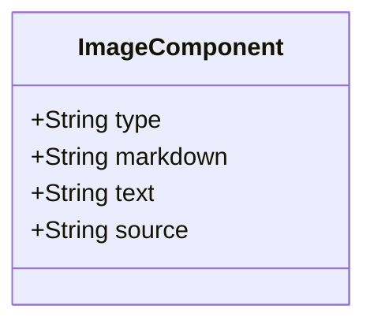

# Image

In Markdown syntax, an HTML image is described using an exclamation mark `!` followed by square brackets `[]` containing the alt text, and immediately after, parentheses () containing the URL of the image. Optionally, a title can be included within double quotes inside the parentheses. For example: ``. This syntax embeds an image within the Markdown document, rendering it visible when the Markdown is converted to HTML or viewed on a platform supporting Markdown rendering.

## Diagram

The following diagram displays the set of possible sub-elements of the component.



## Example markdown: markdown image

The following markdown is an example of the artifact in a file.

```md

```
## Example markdown: image extension

```md
:::image type="content" source="<folderPath>" alt-text="<alt text>" link="<https://link.com>":::
```

See the attribute node, [image node](node-image.md). 

## diagram

Definition


## editorial

Definition

## screenshot

Definition

## wayfinder

Definition
## large-image

Definition

## More components

[Library of components](document-object-model.md#library-of-defined-components-in-the-ca-object-model)