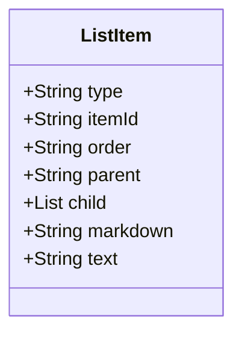

# List

These are ordered or unordered sequences of items. Ordered lists (often represented with numbers) have a specific sequence, while unordered lists (often represented with bullets) don't emphasize any particular order.

## Diagram

The following diagram displays the set of possible sub-elements of the component.



## Example markdown

The following markdown is an example of the artifac in a file.

```md
# **This** is where [you want to go](file.md).
```

## JSON parsed object

The following JSON represents the attributes of a parsed artifact.

```json
{
    "type": "list-item",
    "item-id" : "16BA0E6F-561B-44F1-A17D-7A8F63C51560",
    "order": "1",
    "parent" : "root",
    "child" : [{
    "type": "bold",
    "item-id" : "04ADB55B-567B-4FD7-A889-2F68E86F6F1C",
    "order": "1"
    "parent" : "16BA0E6F-561B-44F1-A17D-7A8F63C51560",
    "child" : []
    "markdown": "**This**",
    "text": "This"
},{
    "type": "link",
    "item-id" : "AC055903-72A4-41FD-8BC5-6B526EB768D1",
    "order": "2"
    "parent" : "16BA0E6F-561B-44F1-A17D-7A8F63C51560",
    "child" : []
    "markdown": "[you want to go](file.md)",
    "text": "you want to go",
    "href": "file.md"
}]
    "markdown": "# **This** is where [you want to go](file.md).",
    "text": "This is where you want to go"
}
```

## JSON Schema for a parsed object

A JSON Schema provides a contract for the JSON data required by a given application and how that JSON data should be structured. It describes the structure of the JSON data, specifying what properties are required, the types of values, and more.

```json
{
  "$schema": "http://json-schema.org/draft-04/schema#",
  "type": "object",
  "properties": {
    "type": {
      "type": "string"
    },
    "item-id": {
      "type": "string"
    },
    "order": {
      "type": "string"
    },
    "parent": {
      "type": "string"
    },
    "child": {
      "type": "array",
      "items": {}
    },
    "markdown": {
      "type": "string"
    },
    "text": {
      "type": "string"
    }
  },
  "required": [
    "type",
    "item-id",
    "order",
    "parent",
    "child",
    "markdown",
    "text"
  ]
}

```


## bullet

Definition

**Diagram**


```markdown
  - item
  - item
  - item
```

**Parsed**

```json
type: X
level: X
markdown:
text: X
```


## checklist

Definition

**Diagram**


```markdown
  > [!div class="checklist"]
  > * List item 1
  > * List item 2
  > * List item 3
```

**Parsed**

```json
type: X
level: X
markdown:
text: X
```


## numbered

Definition

**Diagram**


```markdown
  1. Item
  2. Item
  3. Item

```

**Parsed**

```json
type: X
level: X
markdown:
text: X
```


## More components

[Library of components](document-object-model.md#library-of-defined-components-in-the-ca-object-model)