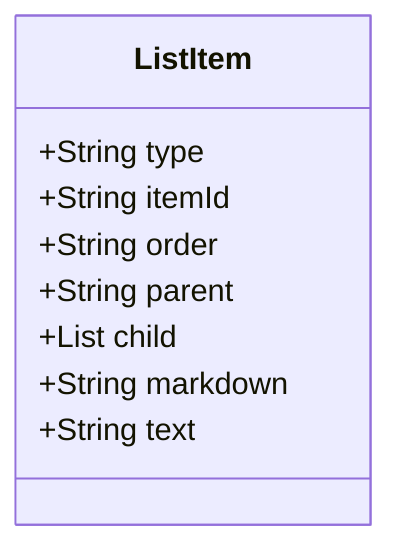

# List

These are ordered or unordered sequences of items. Ordered lists (often represented with numbers) have a specific sequence, while unordered lists (often represented with bullets) don't emphasize any particular order.

TODO: Because lists can contain lists, a list contain the marker that tells if a list contained in a list is ordered or unordered.

## Diagram

The following diagram displays the set of possible sub-elements of the component.



## Example markdown

The following markdown is an example of the artifac in a file.

```md
# **This** is where [you want to go](file.md).
```

## JSON parsed object

The following JSON represents the attributes of a parsed artifact.

```json
{
    "type": "list-item",
    "id": "guid",
    "attributes": [
        {
            "order": "1"
        },
        {
            "markdown": "- item"
        },
        {
            "text": "item"
        }
    ],
    "child": []
}

```

## JSON Schema for a parsed object

A JSON Schema provides a contract for the JSON data required by a given application and how that JSON data should be structured. It describes the structure of the JSON data, specifying what properties are required, the types of values, and more.

```json
{
    "$schema": "http://json-schema.org/draft-07/schema#",
    "type": "object",
    "required": ["type", "id", "attributes", "child"],
    "properties": {
        "type": {
            "type": "string",
            "enum": ["list-item"]
        },
        "id": {
            "type": "string",
            "pattern": "^[a-zA-Z0-9-]+$"
        },
        "attributes": {
            "type": "array",
            "minItems": 3,
            "maxItems": 3,
            "items": [
                {
                    "type": "object",
                    "required": ["order"],
                    "properties": {
                        "order": {
                            "type": "string",
                            "pattern": "^[0-9]+$"
                        }
                    },
                    "additionalProperties": false
                },
                {
                    "type": "object",
                    "required": ["markdown"],
                    "properties": {
                        "markdown": {
                            "type": "string",
                            "pattern": "^- .*$"
                        }
                    },
                    "additionalProperties": false
                },
                {
                    "type": "object",
                    "required": ["text"],
                    "properties": {
                        "text": {
                            "type": "string"
                        }
                    },
                    "additionalProperties": false
                }
            ]
        },
        "child": {
            "type": "array",
            "items": {
                "type": "object"
            }
        }
    },
    "additionalProperties": false
}

```


## bullet

Definition

**Diagram**


```markdown
  - item
  - item
  - item
```

**Parsed**

```json
type: X
level: X
markdown:
text: X
```


## checklist

Definition

**Diagram**


```markdown
  > [!div class="checklist"]
  > * List item 1
  > * List item 2
  > * List item 3
```

**Parsed**

```json
type: X
level: X
markdown:
text: X
```


## numbered

Definition

**Diagram**


```markdown
  1. Item
  2. Item
  3. Item

```

**Parsed**

```json
type: X
level: X
markdown:
text: X
```


## More components

[Library of components](document-object-model.md#library-of-defined-components-in-the-ca-object-model)