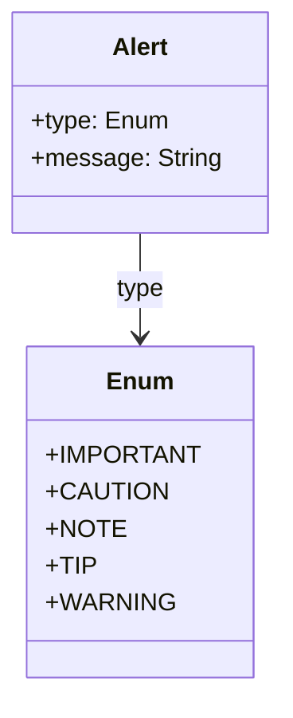

# Table

These are a means of arranging data in rows and columns, (a matrix). Tables are especially useful for presenting numerical data or information in a structured manner. A table typically consists of a header (with column names) and rows of data.

## Diagram

The following diagram displays the set of possible sub-elements of the component.



## Example markdown

The following markdown is an example of the artifact in a file.

```md
|This is   |a simple   |table header|
|----------|-----------|------------|
|table     |data       |here        |
|it doesn't|actually   |have to line up nicely!|
```

## JSON parsed object

The following JSON represents the attributes of a parsed artifact.

```json
{
	"type": "table",
	"markdown": "|This is   |a simple   |table header|\r\n|----------|-----------|------------|\r\n|table     |data       |here        |\r\n|it doesn't|actually   |have to line up nicely!|",
	"columns": "3",
	"rows": "2",
	"headers": [{
		"1": "This is"
	}, {
		"2": "a simple"
	}, {
		"3": "table header"
	}],
	"1": [{
		"1": "Table"
	}, {
		"2": "data"
	}, {
		"3": "here"
	}],
	"2": [{
		"1": "it doesn't"
	}, {
		"2": "actually"
	}, {
		"3": "table header"
	}]
}
```

## JSON Schema for a parsed object

A JSON Schema provides a contract for the JSON data required by a given application and how that JSON data should be structured. It describes the structur"e of the JSON data, specifying what properties are required, the types of values, and more.

```json
{
  "$schema": "http://json-schema.org/draft-04/schema#",
  "type": "object",
  "properties": {
    "type": {
      "type": "string"
    },
    "markdown": {
      "type": "string"
    },
    "columns": {
      "type": "string"
    },
    "rows": {
      "type": "string"
    },
    "headers": {
      "type": "array",
      "items": [
        {
          "type": "object",
          "properties": {
            "1": {
              "type": "string"
            }
          },
          "required": [
            "1"
          ]
        },
        {
          "type": "object",
          "properties": {
            "2": {
              "type": "string"
            }
          },
          "required": [
            "2"
          ]
        },
        {
          "type": "object",
          "properties": {
            "3": {
              "type": "string"
            }
          },
          "required": [
            "3"
          ]
        }
      ]
    },
    "1": {
      "type": "array",
      "items": [
        {
          "type": "object",
          "properties": {
            "1": {
              "type": "string"
            }
          },
          "required": [
            "1"
          ]
        },
        {
          "type": "object",
          "properties": {
            "2": {
              "type": "string"
            }
          },
          "required": [
            "2"
          ]
        },
        {
          "type": "object",
          "properties": {
            "3": {
              "type": "string"
            }
          },
          "required": [
            "3"
          ]
        }
      ]
    },
    "2": {
      "type": "array",
      "items": [
        {
          "type": "object",
          "properties": {
            "1": {
              "type": "string"
            }
          },
          "required": [
            "1"
          ]
        },
        {
          "type": "object",
          "properties": {
            "2": {
              "type": "string"
            }
          },
          "required": [
            "2"
          ]
        },
        {
          "type": "object",
          "properties": {
            "3": {
              "type": "string"
            }
          },
          "required": [
            "3"
          ]
        }
      ]
    }
  },
  "required": [
    "type",
    "markdown",
    "columns",
    "rows",
    "headers",
    "1",
    "2"
  ]
}

```


## More components

[Library of components](document-object-model.md#library-of-defined-components-in-the-ca-object-model)