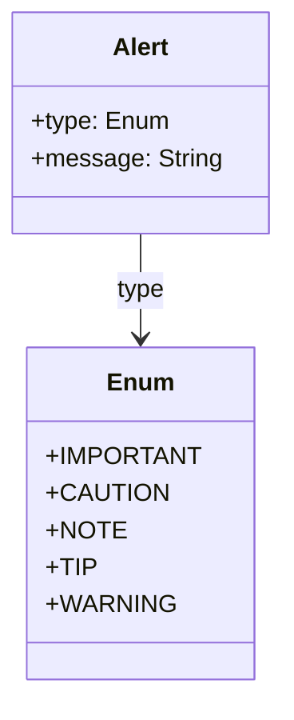

# Table

These are a means of arranging data in rows and columns, (a matrix). Tables are especially useful for presenting numerical data or information in a structured manner. A table typically consists of a header (with column names) and rows of data.

## Diagram

The following diagram displays the set of possible sub-elements of the component.



## Example markdown

The following markdown is an example of the artifact in a file.

```md
|This is   |a simple   |table header|
|----------|-----------|------------|
|table     |data       |here        |
|it doesn't|actually   |have to line up nicely!|
```

## JSON parsed object

The following JSON represents the attributes of a parsed artifact.

```json
{
    "type": "table",
    "id": "guid",
    "attributes": [
        {
            "markdown": "|This is   |a simple   |table header|\r\n|----------|-----------|------------|\r\n|table     |data       |here        |\r\n|it doesn't|actually   |have to line up nicely!|"
        },
        {
            "columns": "3"
        },
        {
            "rows": "2"
        },
        {
            "headers": [
                {
                    "1": "This is"
                },
                {
                    "2": "a simple"
                },
                {
                    "3": "table header"
                }
            ]
        },
        {
            "1": [
                {
                    "1": "Table"
                },
                {
                    "2": "data"
                },
                {
                    "3": "here"
                }
            ]
        },
        {
            "2": [
                {
                    "1": "it doesn't"
                },
                {
                    "2": "actually"
                },
                {
                    "3": "table header"
                }
            ]
        }
    ]
}
```

`TODO`: Each cell can contain a node with attributes and children.

## JSON Schema for a parsed object

A JSON Schema provides a contract for the JSON data required by a given application and how that JSON data should be structured. It describes the structure of the JSON data, specifying what properties are required, the types of values, and more.

```json
{
    "$schema": "http://json-schema.org/draft-07/schema#",
    "type": "object",
    "required": ["type", "id", "attributes"],
    "properties": {
        "type": {
            "type": "string",
            "enum": ["table"]
        },
        "id": {
            "type": "string",
            "pattern": "^[a-zA-Z0-9-]+$"
        },
        "attributes": {
            "type": "array",
            "minItems": 6,
            "items": [
                {
                    "type": "object",
                    "required": ["markdown"],
                    "properties": {
                        "markdown": {"type": "string"}
                    },
                    "additionalProperties": false
                },
                {
                    "type": "object",
                    "required": ["columns"],
                    "properties": {
                        "columns": {
                            "type": "string",
                            "pattern": "^[0-9]+$"
                        }
                    },
                    "additionalProperties": false
                },
                {
                    "type": "object",
                    "required": ["rows"],
                    "properties": {
                        "rows": {
                            "type": "string",
                            "pattern": "^[0-9]+$"
                        }
                    },
                    "additionalProperties": false
                },
                {
                    "type": "object",
                    "required": ["headers"],
                    "properties": {
                        "headers": {
                            "type": "array",
                            "items": {
                                "type": "object",
                                "minProperties": 1,
                                "additionalProperties": {
                                    "type": "string"
                                }
                            }
                        }
                    },
                    "additionalProperties": false
                },
                {
                    "type": "object",
                    "patternProperties": {
                        "^[0-9]+$": {
                            "type": "array",
                            "items": {
                                "type": "object",
                                "minProperties": 1,
                                "additionalProperties": {
                                    "type": "string"
                                }
                            }
                        }
                    },
                    "additionalProperties": false
                }
            ]
        }
    },
    "additionalProperties": false
}


```

Notes on the JSON Schema.

- The `type` property must be a string and its value must be "table".
- The `id` property must be a string and can contain alphanumeric characters and hyphens.
- The `attributes` property must be an array and should contain at least six items. 
  - The first item must have a "markdown" property of type string.
  - The second item must have a "columns" property of type string, representing a number.
  - The third item must have a "rows" property of type string, representing a number.
  - The fourth item must have a "headers" property which is an array of objects, each containing string values.
  - The fifth and subsequent items represent the rows of the table, with each property being an array of objects containing string values.
- `additionalProperties` is set to false to ensure no additional properties are present in the object.

This schema generalizes the table construct, allowing for tables of different sizes with different headers and row data, while still maintaining the structure outlined in the provided JSON object.

## More components

[Library of components](document-object-model.md#library-of-defined-components-in-the-ca-object-model)