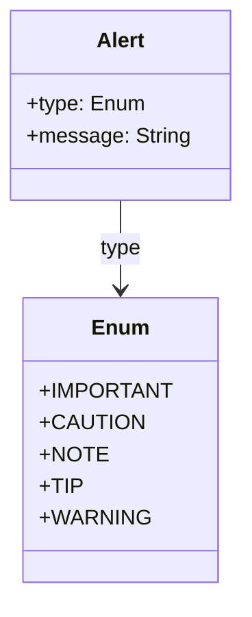

# Video

Definition

## Diagram

The following diagram displays the set of possible sub-elements of the component.



## Example markdown

The following markdown is an example of the artifact in a file.

```md
  > [!CAUTION]
  > Negative potential consequences of an action.
```

## JSON parsed object

The following JSON represents the attributes of a parsed artifact.

```json
{
    "type": "component-name",
    "id": "guid",
    "attributes": [
        {
            "markdown": "markdown"
        },
        {
            "text": "text-only"
        }
    ],
    "child": []
}
```

## JSON Schema for a parsed object

A JSON Schema provides a contract for the JSON data required by a given application and how that JSON data should be structured. It describes the structure of the JSON data, specifying what properties are required, the types of values, and more.

```json
{
  "$schema": "http://json-schema.org/draft-04/schema#",
  "type": "object",
  "properties": {
    "type": {
      "type": "string"
    },
    "level": {
      "type": "string"
      "enum": ["IMPORTANT", "CAUTION", "NOTE", "TIP", "WARNING"],
      "description": "The type of the message. It can be 'IMPORTANT', 'CAUTION', 'NOTE', 'TIP', or 'WARNING'."
    },
    "markdown": {
      "type": "string"
    },
    "text": {
      "type": "string"
      "minLength": 1,
      "description": "The message conveying information about dangerous certain consequences of an action."
    }
  },
  "required": [
    "type",
    "level",
    "markdown",
    "text"
  ]
}

```

## More components

[Library of components](document-object-model.md#library-of-defined-components-in-the-ca-object-model)