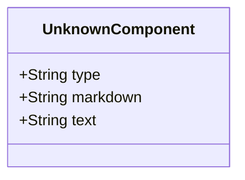

# Unknown component

A container for components that an inventory process can't identify as a defined component.

## Diagram

The following diagram displays the set of possible sub-elements of the component.



## Example markdown

The following markdown is an example of the artifact in a file.

```md
{{unknown markdown construct}}
```

## JSON parsed object

The following JSON represents the attributes of a parsed artifact.

```json
{
    "type": "component-unknown",
    "markdown": "markdown",
    "text": "text-only"
}
```

## JSON Schema for a parsed object

A JSON Schema provides a contract for the JSON data required by a given application and how that JSON data should be structured. It describes the structure of the JSON data, specifying what properties are required, the types of values, and more.

```json
{
  "$schema": "http://json-schema.org/draft-04/schema#",
  "type": "object",
  "properties": {
    "type": {
      "type": "string"
    },
    "markdown": {
      "type": "string"
    },
    "text": {
      "type": "string"
    }
  },
  "required": [
    "type",
    "markdown",
    "text"
  ]
}

```

## More components

[Library of components](document-object-model.md#library-of-defined-components-in-the-ca-object-model)