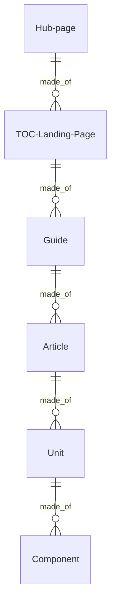
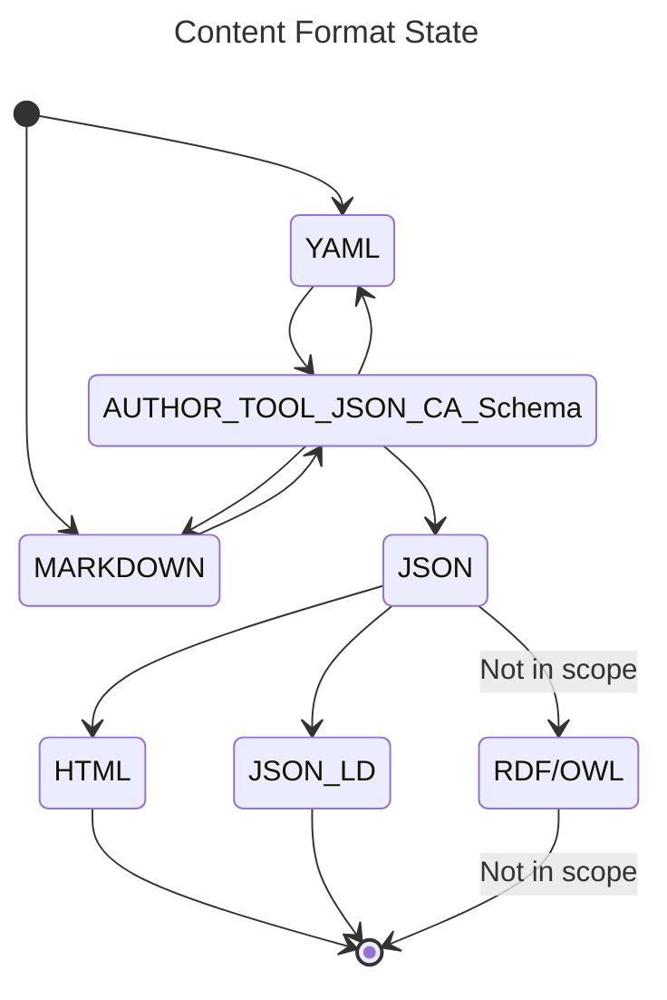

# Learn Microsoft.com Document Object Model

Draft: 10/1/2023

Content is the material that appears in the 'content well' of the learn.Microsoft.com website. This includes the table of contents and the articles (text, graphics, and videos). Current content modalities include technical documentation and training.

Content Architecture defines a subset of structures in the [Unified Content Model](https://review.learn.microsoft.com/help/patterns/library/contribute-unified-content-model) (UCM). Content Architecture fits under the [Article](https://review.learn.microsoft.com/help/patterns/library/contribute-unified-content-mode#article) section of the UCM and provides support for the Table of Contents (that is not specified in the UCM).

## Content Architecture 

The content architecture is driven by writer and user requirements through _A Pattern Language_ defined in the [Content Pattern Library](https://review.learn.microsoft.com/help/patterns/?branch=main). A [design pattern](https://www.patternlanguage.com) is a proven and repeatable solution to a writer and customer problem. These patterns are defined and presented using a modular system of documentation templates that are validated using schemas described in JSON Schema and declarative rules.

The architecture is formally described in Resource Description framework ([RDF](https://www.w3.org/RDF))/ Web Ontology Language ([OWL](https://www.w3.org/TR/owl2-syntax/)) using a domain-specific ontology approach following the best practices in the Basic Ontology Framework.

This formal description represents the concepts in the domain that includes the Content Architecture Object Model. The Content Architecture Object model is made of the objects (that can be thought of as tokens in _A Pattern Language_) and their relationships (that can be bought of the syntax of the pattern language.)

The Object Model also serves an API for systems that must integrate with the content architecture. To support these systems, the subset of objects in the ontology are described using JSON Schema and these schemas are offered through the Object Store in the Learn.Microsoft.com platform.

The objects are:

- **Hub page**: Design specification `TBD`
- **TOC/Landing Page**: [Design specification](https://review.learn.microsoft.com/help/patterns/program/design-pattern-library-level2?branch=main)
- **Guide**: [Design specification](https://review.learn.microsoft.com/help/patterns/program/design-pattern-library-level3)
- **Article**: [Design specification](https://review.learn.microsoft.com/help/patterns/program/design-pattern-library-level4)
- **Unit**: Design specification `TBD`
- **Component**: Design specification `TBD`

Broadly, content architecture is composed of a set of composite objects. The smallest item, a chunk of markdown, is called a component. A unit is defined as an array of components. An article is defined as an array of units. A guide is defined as an array of articles. a TOC/Landing page is defined as an array of guides. A Hub page is defined as an array of TOC/Landing pages.



For more information see:
- [Program documentation for the Content Pattern Library](https://review.learn.microsoft.com/help/patterns/program/?branch=main)
- [Microsoft Content Pattern Library documentation](https://review.learn.microsoft.com/help/patterns/?branch=main)
## Hub pages, TOCs, Guides  

An Hub page then can be described as a schema defining the array of TOCs/Landing pages. And each TOCs/Landing pages can be described as an array of guides. In turn each guide is an array of articles.

```
Hub:
    <hub metdata>    
TOCs:
    TOC 1:
    <toc metadata>
    Content:
    <toc>
        Guide 1:
        <guide metadata>
        Articles:
            <...>
    TOC 2:
    <toc metadata>
    Content:
    <toc>
        Guide 1:
        <guide metadata>
        Articles:
            <...>
    TOC 3:
    <toc metadata>
    Content:
    <toc>
        Guide 1:
        <guide metadata>
        Articles:
            <...>    
```

## Article, unit, component

An article then can be described as a schema defining the array of units. And each unit can be described as an array of components.

```
article:
  - metadata:
    type:
    platformid:
  - body:
      - unit:
        - metadata:
          type:
          platformid:
        - body:
          - component:
            - metadata:
              type:
              platformid:
            - body |
                {{represenation}} # see the json parsed object
        - unit:
          - metadata:
            type:
            platformid:
          - body:
            - component:
              - metadata:
                type:
                platformid:
              - body |
                  {{represenation}} # see the json parsed object
```
## Interaction of the YAML document format and the parser

The document author works in a human-readable serialization language. This section assums the publishing platform uses YAML/JSON. The state diagram places the CA Object Model (represented as an API by a set of JSON schemas) within the transformation of written and generated content into content delivered to the publishing targets:
- **Web site (HTML)**. This is consumed by readers using a web browser.
- **Semantic representation (JSON-LD)**. Moz writes "JSON-LD is implemented leveraging the Schema.org vocabulary, a joint effort by Google, Bing, Yahoo!, and Yandex in 2011 to create a unified structured data vocabulary for the web."
- **RDF/OWL (Linked Data)**.  _Not in scope_. RDF and OWL are based on the Resource Description Framework (RDF) and the Web Ontology Language (OWL), respectively. They are used to represent data in a graph format, where nodes represent entities and edges represent relationships between them. RDF is used to represent metadata, while OWL is used to represent ontologies"([ref](https://spinrdf.org/shacl-and-owl.html)). RDF would support a Learn Knowledge Graph.



| Format | Notes |
| --- | --- |
| MARKDOWN | An author can write in markdown or open a markdown document. The markdown down document will be parsed for structure and validated by a JSON Schema and set of rules. An author can save the file in YAML or Markdown. Markdown cannot be used as structured content. |
| YAML | A YAML document is validated with a JSON Schema and set of rules. Saved, the file can be used as structured content.  |
| AUTHOR_TOOL_JSON_CA_Schema | Authoring tools can use the JSON Schema and a set of rules to validate a document. This particular version of JSON is in this model called JSON CA Schema. |
| JSON | The Publishing platform uses DocFX that renders content as 'content blocks." The platform also uses JSON Schema and set of rules to validate content. Valid content is sent through the rendering service which performs the transforms on the content to the publishing targets. |
| HTML | HTML (HyperText Markup Language) is the foundational language for creating web pages on the World Wide Web. While it structures content for visual presentation, embedding links, images, and multimedia, HTML itself is not structured content; it doesn't inherently convey the semantic meaning or relationship of the data, focusing more on the display aspect.|
| JSON_LD | JSON-LD (JavaScript Object Notation for Linked Data) is a method of encoding Linked Data using JSON. As a publishing vehicle, it enables the structuring and representation of data in a way that is both human and machine-readable, allowing the definition and conveyance of semantic context and relationships within the data. |
| RDF/OWL | RDF/OWL are foundational technologies of the Semantic Web. RDF (Resource Description Framework) publishes structured information about resources, allowing semantic interoperability. OWL (Web Ontology Language) extends RDF, enabling the expression of complex relationships and ontologies, allowing machines to understand and infer knowledge, fostering a more intelligent and integrated web. |


### [Markdown(#tab/markdown)]

```
---
    type: how-to
    platformid: 75BAFFCD-0FEF-4CBD-9ABF-B5546332F021
    title: How to write a piece of structured content
    description: Craft structured content for a publishing system, begin with a
      clear, concise title that encapsulates the main theme
    author: mattbriggs
    ms.author: mabrigg
    ms.service: testing
    ms.date: 09/24/2023

# CustomerIntent: As a < type of user >, I want < what? > so that < why? >.

---

# How to write a piece of structured content

When crafting structured content for a publishing system, begin with a
clear, concise title that encapsulates the main theme. Follow with
an engaging introduction, outlining the content's purpose. Utilize
headings and subheadings to organize ideas logically, and employ
bullet points or numbered lists for clarity. Embed relevant keywords
for SEO optimization and incorporate multimedia elements to enhance
user engagement. Conclude with a succinct summary, reiterating key
points. Review for coherence, consistency, and grammatical accuracy
before publishing.

## Prequisites

Before your start writing structured content, you will need the 
following things:
  - You need this thing.
  - You need this thing.
  - You need this thing.

## Do these these things to accomplish your goals

You will do the following things:

  # Do this action.
  # Do this action.
  # Do this action.

## Do more things to accomplish even more of your goals

You will do the following things:

  # Do this action.
  # Do this action.
  # Do this action.

## Next step

> [!div class="nextstepaction"]
> [Write concepts](article-concept.md)

```
### [YAML](#tab/yaml)

```
article:
  metadata:
    type: how-to
    platformid: 75BAFFCD-0FEF-4CBD-9ABF-B5546332F021
    title: How to write a piece of structured content
    description: Craft structured content for a publishing system, begin with a
      clear, concise title that encapsulates the main theme
    author: mattbriggs
    ms.author: mabrigg
    ms.service: testing
    ms.date: 09/24/2023
    CustomerIntent: As a < type of user >, I want < what? > so that < why? >.
  body:
    - unit:
        - metadata:
            type: introduction
            platformid: A5C26791-2143-4C45-9133-D3EB3FC9A5F4
        - body:
            - component:
                - metadata:
                    type: h1
                    platformid: 7405A916-136C-4094-B753-B549D58F88C2
                - body: How to write a piece of structured content
            - component:
                - metadata:
                    type: paragraph
                    platformid: 7405A916-136C-4094-B753-B549D58F88C2
                - body: >
                    When crafting structured content for a publishing system, begin with a
                    clear, concise title that encapsulates the main theme. Follow with
                    an engaging introduction, outlining the content's purpose. Utilize
                    headings and subheadings to organize ideas logically, and employ
                    bullet points or numbered lists for clarity. Embed relevant keywords
                    for SEO optimization and incorporate multimedia elements to enhance
                    user engagement. Conclude with a succinct summary, reiterating key
                    points. Review for coherence, consistency, and grammatical accuracy
                    before publishing.
    - unit:
        - metadata:
            type: prequisites
            platformid: 7D3098DB-1D8E-48AE-B309-2722C262E127
        - body:
            - component:
                - metadata:
                    type: h2
                    platformid: 6A37C122-E3AD-41BE-903A-B5D911DD898F
                - body: Prequisites
            - component:
                - metadata:
                    type: paragraph
                    platformid: 6A37C122-E3AD-41BE-903A-B5D911DD898F
                - body: >
                    Before your start writing structured content, you will need the following

                    things:
            - component:
                - metadata:
                    type: bullet-list
                    platformid: 6A37C122-E3AD-41BE-903A-B5D911DD898F
                - body: |
                    - You need this thing.
                    - You need this thing.
                    - You need this thing.
    - unit:
        - metadata:
            type: procedural
            platformid: E4666197-82B8-4515-8D0B-F222D05073FE
    - body:
        - component:
            - metadata:
                type: h2
                platformid: C22A4EA0-5932-4C67-A4B0-ECE7AB926851
            - body: Do these these things to accomplish your goals
        - component:
            - metadata:
                type: paragraph
                platformid: CB338313-9E6E-41D2-A47B-710DD0FCC0AB
            - body: |
                You will do the following things:
        - component:
            - metadata:
                type: bullet-list
                platformid: DB120313-8295-4221-A8FB-807759D4DB45
            - body: |
                # Do this action.
                # Do this action.
                # Do this action.
    - unit:
        - metadata:
            type: procedural
            platformid: E4666197-82B8-4515-8D0B-F222D05073FE
        - body:
            - component:
                - metadata:
                    type: h2
                    platformid: C22A4EA0-5932-4C67-A4B0-ECE7AB926851
                - body: Do more things to accomplish even more of your goals
            - component:
                - metadata:
                    type: paragraph
                    platformid: CB338313-9E6E-41D2-A47B-710DD0FCC0AB
                - body: |
                    You will do the following things:
            - component:
                - metadata:
                    type: bullet-list
                    platformid: DB120313-8295-4221-A8FB-807759D4DB45
                - body: |
                    # Do this action.
                    # Do this action.
                    # Do this action.
    - unit:
        - metadata:
            type: next-step-unit
            platformid: 7A31FB54-C5D1-41C2-9E98-0751310F99AA
        - body:
            - component:
                - metadata:
                    type: button-link
                    platformid: 61BBE6D9-D105-459D-B74A-9407D976174A
            - body: |
                > [!div class="nextstepaction"]
                > [Write concepts](article-concept.md)

```
---

### [JSON_CA_schema](#tab/json_ca_schema)

```
{
    "article": {
        "metadata": {
            "type": "how-to",
            "platformid": "75BAFFCD-0FEF-4CBD-9ABF-B5546332F021",
            "title": "How to write a piece of structured content",
            "description": "Craft structured content for a publishing system, begin with a clear, concise title that encapsulates the main theme",
            "author": "mattbriggs",
            "ms.author": "mabrigg",
            "ms.service": "testing",
            "ms.date": "09/24/2023",
            "CustomerIntent": "As a < type of user >, I want < what? > so that < why? >."
        },
        "body": [
            {
                "unit": [
                    {
                        "metadata": {
                            "type": "introduction",
                            "platformid": "A5C26791-2143-4C45-9133-D3EB3FC9A5F4"
                        }
                    },
                    {
                        "body": [
                            {
                                "component": [
                                    {
                                        "metadata": {
                                            "type": "h1",
                                            "platformid": "7405A916-136C-4094-B753-B549D58F88C2"
                                        }
                                    },
                                    {
                                        "body": "How to write a piece of structured content"
                                    }
                                ]
                            },
                            {
                                "component": [
                                    {
                                        "metadata": {
                                            "type": "paragraph",
                                            "platformid": "7405A916-136C-4094-B753-B549D58F88C2"
                                        }
                                    },
                                    {
                                        "body": "When crafting structured content for a publishing system, begin with a\nclear, concise title that encapsulates the main theme. Follow with\nan engaging introduction, outlining the content's purpose. Utilize\nheadings and subheadings to organize ideas logically, and employ\nbullet points or numbered lists for clarity. Embed relevant keywords\nfor SEO optimization and incorporate multimedia elements to enhance\nuser engagement. Conclude with a succinct summary, reiterating key\npoints. Review for coherence, consistency, and grammatical accuracy\nbefore publishing.\n"
                                    }
                                ]
                            }
                        ]
                    }
                ]
            },
            {
                "unit": [
                    {
                        "metadata": {
                            "type": "prequisites",
                            "platformid": "7D3098DB-1D8E-48AE-B309-2722C262E127"
                        }
                    },
                    {
                        "body": [
                            {
                                "component": [
                                    {
                                        "metadata": {
                                            "type": "h2",
                                            "platformid": "6A37C122-E3AD-41BE-903A-B5D911DD898F"
                                        }
                                    },
                                    {
                                        "body": "Prequisites"
                                    }
                                ]
                            },
                            {
                                "component": [
                                    {
                                        "metadata": {
                                            "type": "paragraph",
                                            "platformid": "6A37C122-E3AD-41BE-903A-B5D911DD898F"
                                        }
                                    },
                                    {
                                        "body": "Before your start writing structured content, you will need the following\nthings:\n"
                                    }
                                ]
                            },
                            {
                                "component": [
                                    {
                                        "metadata": {
                                            "type": "bullet-list",
                                            "platformid": "6A37C122-E3AD-41BE-903A-B5D911DD898F"
                                        }
                                    },
                                    {
                                        "body": "- You need this thing.\n- You need this thing.\n- You need this thing.\n"
                                    }
                                ]
                            }
                        ]
                    }
                ]
            },
            {
                "unit": [
                    {
                        "metadata": {
                            "type": "procedural",
                            "platformid": "E4666197-82B8-4515-8D0B-F222D05073FE"
                        }
                    }
                ]
            },
            {
                "body": [
                    {
                        "component": [
                            {
                                "metadata": {
                                    "type": "h2",
                                    "platformid": "C22A4EA0-5932-4C67-A4B0-ECE7AB926851"
                                }
                            },
                            {
                                "body": "Do these these things to accomplish your goals"
                            }
                        ]
                    },
                    {
                        "component": [
                            {
                                "metadata": {
                                    "type": "paragraph",
                                    "platformid": "CB338313-9E6E-41D2-A47B-710DD0FCC0AB"
                                }
                            },
                            {
                                "body": "You will do the following things:\n"
                            }
                        ]
                    },
                    {
                        "component": [
                            {
                                "metadata": {
                                    "type": "bullet-list",
                                    "platformid": "DB120313-8295-4221-A8FB-807759D4DB45"
                                }
                            },
                            {
                                "body": "# Do this action.\n# Do this action.\n# Do this action.\n"
                            }
                        ]
                    }
                ]
            },
            {
                "unit": [
                    {
                        "metadata": {
                            "type": "procedural",
                            "platformid": "E4666197-82B8-4515-8D0B-F222D05073FE"
                        }
                    },
                    {
                        "body": [
                            {
                                "component": [
                                    {
                                        "metadata": {
                                            "type": "h2",
                                            "platformid": "C22A4EA0-5932-4C67-A4B0-ECE7AB926851"
                                        }
                                    },
                                    {
                                        "body": "Do more things to accomplish even more of your goals"
                                    }
                                ]
                            },
                            {
                                "component": [
                                    {
                                        "metadata": {
                                            "type": "paragraph",
                                            "platformid": "CB338313-9E6E-41D2-A47B-710DD0FCC0AB"
                                        }
                                    },
                                    {
                                        "body": "You will do the following things:\n"
                                    }
                                ]
                            },
                            {
                                "component": [
                                    {
                                        "metadata": {
                                            "type": "bullet-list",
                                            "platformid": "DB120313-8295-4221-A8FB-807759D4DB45"
                                        }
                                    },
                                    {
                                        "body": "# Do this action.\n# Do this action.\n# Do this action.\n"
                                    }
                                ]
                            }
                        ]
                    }
                ]
            },
            {
                "unit": [
                    {
                        "metadata": {
                            "type": "next-step-unit",
                            "platformid": "7A31FB54-C5D1-41C2-9E98-0751310F99AA"
                        }
                    },
                    {
                        "body": [
                            {
                                "component": [
                                    {
                                        "metadata": {
                                            "type": "button-link",
                                            "platformid": "61BBE6D9-D105-459D-B74A-9407D976174A"
                                        }
                                    }
                                ]
                            },
                            {
                                "body": "> [!div class=\"nextstepaction\"]\n> [Write concepts](article-concept.md)\n"
                            }
                        ]
                    }
                ]
            }
        ]
    }
}
```
---

---
### [JSON](#tab/json)

This is the JSON section. 

---
### [HTML](#tab/html)

This is the HTML section.

---

## Components

A component can be thought of a component is an HTML block on the web site, and a JSON-LD representation for programmatic consumption of the content. To go to the beginning, the component exists as content block in HTML terms. Like HTML content blocks, a component fills the entire content column.


### About components

Components are composed of elements that are part of the definition of each component. This section looks at what a components is, and is followed by the library of components that make up the defined Content Architecture Object Model.

A component exits in several states within the system. In its final state, the component may exist in two states: a markdown block and the text. The markdown block is parsed into JSON and then used by the rendering templates that create the HTML and JSON-LD public web state of the component.

A component exists in relation to other elements of the content architecture. A unit object contains the an array of component objects. An article object contains an array of unit objects. Above the level of the article, a guide object contains an array of articles and label nodes. A TOC object contains an array of articles, labels, and articles.

Components can contain components. For example, a list item can contain a list.

### Components as content blocks

The types of media that are displayed in the content well include:

- **Text blocks**: Content blocks that contains text elements are natural language parts that can be understood by a person reading the text. Text elements are not structured using purely prescriptive models, however they can be parsed into programmatic representations using a variety of techniques. NLP processing creates a syntactical model that contains attributes such a part of speech, entity recognition, sentence recognition, and so on. Vector representations convert text, sentences, and so on into a numeric coordinates. The purpose of text is to communicate information to a human reader. Textual superstructures such as modality organize text chunks with specific purposes to accomplish more complex information tasks such as teaching a reader skill or presenting information for a reader to accomplish a task. 
    - **Text**: This refers to the primary content in any written communication. In digital media, it's the sequence of words, sentences, and paragraphs that convey information or a message to the reader.
    - **Tables**: These are a means of arranging data in rows and columns, (a matrix). Tables are especially useful for presenting numerical data or information in a structured manner. A table typically consists of a header (with column names) and rows of data.
    - **Lists**: These are ordered or unordered sequences of items. Ordered lists (often represented with numbers) have a specific sequence, while unordered lists (often represented with bullets) don't emphasize any particular order
    - **Headings**: Headings are used to label sections or subsections of a text, helping to organize content and make it reader-friendly. They typically come in different levels (e.g., H1, H2, H3 in HTML) to indicate hierarchy.
    - **Inline elements**: In web design and word processing, inline elements are those that don't start on a new line and only take up as much width as necessary. They flow within the text, as opposed to block-level elements which take up the full width available. Examples include **bold** or _italicized_ text.
        - italic
        - bold
        - code
        - Hyperlinks
        - Managed terms
        - Semantic markers
- **Metadata**: Metadata is data about data. It is information that describes the characteristics of a data set, such as its size, format, and content. Metadata can also include information about the data's origin, purpose, and usage. Metadata is used to help organize, manage, and search for data, as well as to provide context for the data.
    - **Metadata about the content**. This is metadata that accompanies the content such as titles, description, and so on.
    - **Metadata related to the organization**. This metadata is related to controlled vocabularies in managed taxonomies. 
    - **Microdata**. Microdata is a type of structured data that is used to provide additional information about a web page or other online content. It is typically embedded in the HTML code of a web page and is used to provide search engines with more information about the page and its content. This can help search engines better understand the content of the page and provide more relevant search results. Microdata can also be used to provide additional information to web browsers, such as the author of the page or the date it was last updated.. 
- **Images**. An image is referenced as a content block in markdown as an image construct and in HTML as an \ element.
    - **Diagrams**: A diagram is a visual representation of information or data, usually presented in the form of a graph, chart, or illustration. It is used to convey complex ideas or concepts in a simple and easy-to-understand way. Diagrams can be used to represent relationships between different elements, or to show the flow of a process.
    - **Screenshots**: Screenshots are digital images of what is currently being displayed on a computer monitor, smartphone, or other device. They are typically taken by pressing a combination of keys or buttons on the device, and can be used to capture a specific moment in time, or to document a problem or issue with a program or device. Screenshots can also be used to share information or to show someone how to do something on a device.
    - **Conceptual art**: Conceptual art is an art form that focuses on the idea or concept behind the work, rather than the physical or visual aspects. It is often characterized by the use of unconventional materials and techniques, and is often seen as a form of protest against traditional art forms. Conceptual art often relies on the viewer to interpret the meaning behind the work, and can be seen as a form of communication between the artist and the viewer.
- **Code**: Code is a language-specific tokens that can be used in a compiler or runtime to run application. Code is a constructed language meant to communicate unambiguous instructions to a processor.
    - **Code snippet**: A code snippet is a small piece of code that can be used to perform a specific task or solve a particular problem. It is usually a short segment of code that can be used to quickly and easily add a feature or functionality to a larger program. Code snippets can be used to reduce the amount of time and effort needed to write a program, as well as to make the code more readable and maintainable.
    - **Code samples**: A code sample is a small piece of code that is used to demonstrate a programming concept or a specific syntax. It is typically used to illustrate how a particular programming language works, or to demonstrate a specific feature of a programming language. Code samples can be used to help developers learn a new language, or to help them understand a particular concept or feature.
- **Context switchers**. A context switcher is a feature of a web site interface that allows the user to switch between different contexts or views of the same web page. For example, a web page may have different views for desktop, tablet, and mobile devices. The context switcher allows the user to switch between these different views, allowing them to view the page in the context that best suits their device.
    - Zone pivots
    - Moniker (context)
    - Content tabs

Elements on the web site that are not content or are mixed with context and other concerns, are:
- Navigation elements such as breadcrumbs and site menus
- Site URL structure
- Hub pages
- Landing pages
- "Customer facing" taxonomies

### Library of defined Components in the CA object model

Components are composed of elements that are part of the definition of each component. This section defined each component that make up the defined Content Architecture Object Model.

The following table lists the currently defined components:

| Name | Description |
| --- | --- |
| [Alert component](component-alert.md) | Alerts are a Markdown extension to create block quotes that render on Microsoft Learn with colors and icons that indicate the significance of the content. |
| [blockquote component](component-blockquote.md) | A blockquote is used to indicate a section of text that is a quotation from another source. |
| [code-block component](component-code-block.md) | A Markdown code block is a section of text used to display code, commands, or other preformatted text. |
| [columns component](component-columns.md) | `TBD` |
| [header component](component-header.md) | Heading elements are used to define headings in HTML.  |
| [image component](component-image.md) | In Markdown, an image is added using ``. In HTML, it's embedded with ``, providing visuals in documents. |
| [Image icon component](component-image-icon.md) | `TBD` |
| [Image long component](component-image-long.md) | `TBD` |
| [Include component](component-include.md) | An include embed other Markdown files within a Markdown file.  |
| [List component](component-list.md) | These are ordered or unordered sequences of items.  |
| [Paragraph component](componnet-paragraph.md) | In Markdown, a paragraph is text separated by blank lines. In HTML, it's enclosed in `<p>` tags. Both represent blocks of text in documents. |
| [Select component](component-select.md) | `TBD` |
| [Table component](component-table.md) | In Markdown, tables are created using pipes | and dashes - to define columns and headers. In HTML, tables use <table>, <tr>, and <td> tags. |
| [Video component](component-video.md) | 
In Markdown, videos aren't natively supported. In HTML, a video block can be embedded using the <video> tag, with <source> tags defining the video source. |
| [Unknown component](componet-unknown.md) | A placeholder component for markdown that isn't recognized. |

## Attributes nodes

Attribute nodes are inline elements. In web design and word processing, inline elements are those that don't start on a new line and only take up as much width as necessary. Examples include bold or italicized text.

### About attribute nodes

In HTML attributes nodes contain very broad semantic meaning and typically indicate difference in typographic treatment such as bold, italic, underline and so on. Semantic markers can be introduced with the `<span>` tag which is not generally supported by OPS.

### Library of attribute nodes

The following table lists the currently defined attributes nodes:

| Name | Description |
| --- | --- |
| [Anchor attribute](node-anchor.md) | 
Anchor (Hyperlink). Defines a hyperlink. |
| [Bold attribute](node-bold.md) | Bold text. |
| [Code attribute](node-code.md) | Inline code. |
| [Emphasis attribute](node-emphasis.md) | Emphasized text (italic). |
| [Image attribute](node-image) | Image. |
| [Italic attribute](node-italic.md) | Italic text. |
| [Span attribute](node-span.md) | Generic inline container. |
| [Strong attribute](node-strong.md) | Strong importance (bold). |
| [Super/Sub attribute](node-super-sub.md) | `TBD` |
| [Unknown attribute](node-unknown.md) | A placeholder attribute for markdown that isn't recognized. |

## For more information

[Markdown guide](https://www.markdownguide.org/)