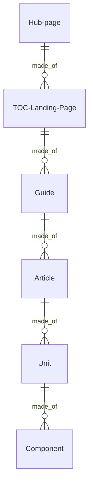
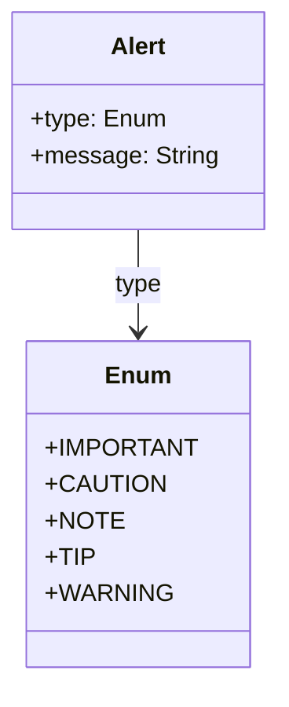
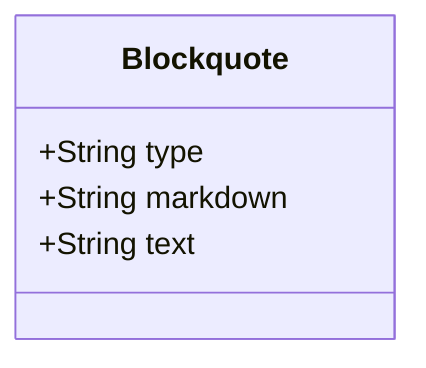
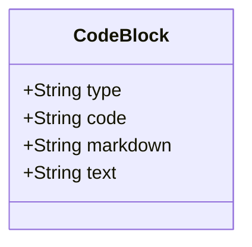
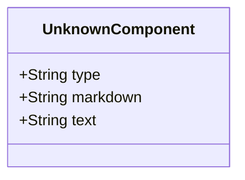
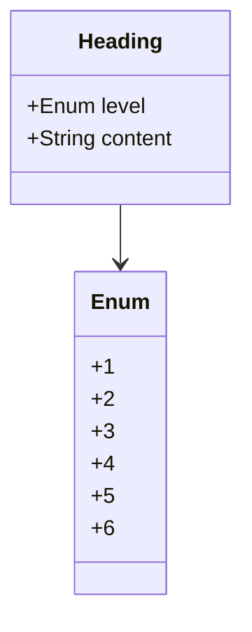
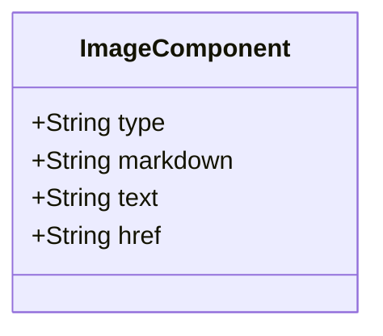
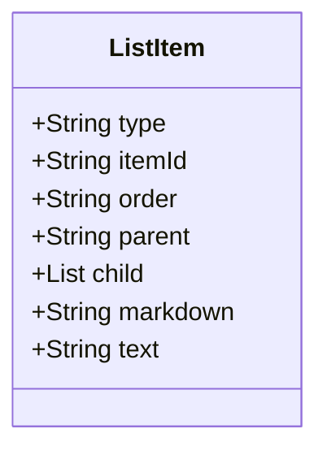

# Learn Microsoft.com Document Object Model

Content is the material that appears in the 'content well' of the learn.Microsoft.com website. This includes the table of contents and the articles (text, graphics, and videos). Current content modalities include technical documentation and training.

Content Architecture defines a subset of structures in the [Unified Content Model](https://review.learn.microsoft.com/help/patterns/library/contribute-unified-content-model) (UCM). Content Architecture fits under the [Article](https://review.learn.microsoft.com/help/patterns/library/contribute-unified-content-mode#article) section of the UCM and provides support for the Table of Contents (that is not specified in the UCM).

## Content Architecture 

The content architecture is driven by writer and user requirements through _A Pattern Language_ defined in the [Content Pattern Library](https://review.learn.microsoft.com/help/patterns/?branch=main). A [design pattern](https://www.patternlanguage.com) is a proven and repeatable solution to a writer and customer problem. These patterns are defined and presented using a modular system of documentation templates that are validated using schemas described in JSON Schema and declarative rules.

The architecture is formally described in Resource Description framework ([RDF](https://www.w3.org/RDF))/ Web Ontology Language ([OWL](https://www.w3.org/TR/owl2-syntax/)) using a domain-specific ontology approach following the best practices in the Basic Ontology Framework.

This formal description represents the concepts in the domain that includes the Content Architecture Object Model. The Content Architecture Object model is made of the objects (that can be thought of as tokens in _A Pattern Language_) and their relationships (that can be bought of the syntax of the pattern language.)

The Object Model also serves an API for systems that must integrate with the content architecture. To support these systems, the subset of objects in the ontology are described using JSON Schema and these schemas are offered through the Object Store in the Learn.Microsoft.com platform.

The objects are:

- **Hub page**: Design specification TBD
- **TOC/Landing Page**: [Design specification](https://review.learn.microsoft.com/help/patterns/program/design-pattern-library-level2?branch=main)
- **Guide**: [Design specification](https://review.learn.microsoft.com/help/patterns/program/design-pattern-library-level3)
- **Article**: [Design specification](https://review.learn.microsoft.com/help/patterns/program/design-pattern-library-level4)
- **Unit**: Design specification TBD
- **Component**: Design specification TBD

Broadly, content architecture is composed of a set of composite objects. The smallest item, a chunk of markdown, is called a component. A unit is defined as an array of components. An article is defined as an array of units. A guide is defined as an array of articles. a TOC/Landing page is defined as an array of guides. A Hub page is defined as an array of TOC/Landing pages.



For more information see:
- [Program documentation for the Content Pattern Library](https://review.learn.microsoft.com/help/patterns/program/?branch=main)
- [Microsoft Content Pattern Library documentation](https://review.learn.microsoft.com/help/patterns/?branch=main)
## Hub pages, TOCs, Guides  

An Hub page then can be described as a schema defining the array of TOCs/Landing pages. And each TOCs/Landing pages can be described as an array of guides. In turn each guide is an array of articles.

```
Hub:
    <hub metdata>    
TOCs:
    TOC 1:
    <toc metadata>
    Content:
    <toc>
        Guide 1:
        <guide metadata>
        Articles:
            <...>
    TOC 2:
    <toc metadata>
    Content:
    <toc>
        Guide 1:
        <guide metadata>
        Articles:
            <...>
    TOC 3:
    <toc metadata>
    Content:
    <toc>
        Guide 1:
        <guide metadata>
        Articles:
            <...>    
```

## Article, unit, component

An article then can be described as a schema defining the array of units. And each unit can be described as an array of components.

```
article:
  metadata
  - items:
    type:
    platformid:
  body:
  - unit:
    metadata:
    - items:
      type:
      platformid:
    body:
    - component:
      metadata:^Markdown
      - items:
        type:
        platformid:
      body:
        {{represenation}} # see the json parsed object
  - unit:
    metadata:
    - items:
      type:
      platformid:
    body:
    - component:
      metadata:
      - items:
        type:
        platformid:
      body:
        {{represenation}} # see the json parsed object

## Components

A component can be thought of a component is an HTML block on the web site, and a JSON-LD representation for programmatic consumption of the content. To go to the beginning, the component exists as content block in HTML terms. Like HTML content blocks, a component fills the entire content column.

Components are composed of elements that are part of the definition of each component. This section looks at what a components is, and is followed by the library of components that make up the defined Content Architecture Object Model.

A component exits in several states within the system. In it's final state, the component may exist in two states:s a markdown block. The markdown block is parsed into JSON and then fed to the rendering templates that create the HTML and JSON-LD public web state of the component.

A component exists in relation to other elements of the content architecture. A unit object contains the an array of component objects. An article object contains an array of unit objects. Above the level of the article, a guide object contains an array of articles and label nodes. A TOC object contains an array of articles, labels, and articles.

The types of media that are displayed in the content well include:

- **Text blocks**: Content blocks that contains text elements are natural language parts that can be understood by a person reading the text. Text elements are not structured using purely prescriptive models, however they can be parsed into programmatic representations using a variety of techniques. NLP processing creates a syntactical model that contains attributes such a part of speech, entity recognition, sentence recognition, and so on. Vector representations convert text, sentences, and so on into a numeric coordinates. The purpose of text is to communicate information to a human reader. Textual superstructures such as modality organize text chunks with specific purposes to accomplish more complex information tasks such as teaching a reader skill or presenting information for a reader to accomplish a task. 
    - **Text**: This refers to the primary content in any written communication. In digital media, it's the sequence of words, sentences, and paragraphs that convey information or a message to the reader.
    - **Tables**: These are a means of arranging data in rows and columns, (a matrix). Tables are especially useful for presenting numerical data or information in a structured manner. A table typically consists of a header (with column names) and rows of data.
    - **Lists**: These are ordered or unordered sequences of items. Ordered lists (often represented with numbers) have a specific sequence, while unordered lists (often represented with bullets) don't emphasize any particular order
    - **Headings**: Headings are used to label sections or subsections of a text, helping to organize content and make it reader-friendly. They typically come in different levels (e.g., H1, H2, H3 in HTML) to indicate hierarchy.
    - **Inline elements**: In web design and word processing, inline elements are those that don't start on a new line and only take up as much width as necessary. They flow within the text, as opposed to block-level elements which take up the full width available. Examples include **bold** or _italicized_ text.
        - italic
        - bold
        - code
        - Hyperlinks
        - Managed terms
        - Semantic markers
- **Metadata**: Metadata is data about data. It is information that describes the characteristics of a data set, such as its size, format, and content. Metadata can also include information about the data's origin, purpose, and usage. Metadata is used to help organize, manage, and search for data, as well as to provide context for the data.
    - **Metadata about the content**. This is metadata that accompanies the content such as titles, description, and so on.
    - **Metadata related to the organization**. This metadata is related to controlled vocabularies in managed taxonomies. 
    - **Microdata**. Microdata is a type of structured data that is used to provide additional information about a web page or other online content. It is typically embedded in the HTML code of a web page and is used to provide search engines with more information about the page and its content. This can help search engines better understand the content of the page and provide more relevant search results. Microdata can also be used to provide additional information to web browsers, such as the author of the page or the date it was last updated.. 
- **Images**. An image is referenced as a content block in markdown as an image construct and in HTML as an \ element.
    - **Diagrams**: A diagram is a visual representation of information or data, usually presented in the form of a graph, chart, or illustration. It is used to convey complex ideas or concepts in a simple and easy-to-understand way. Diagrams can be used to represent relationships between different elements, or to show the flow of a process.
    - **Screenshots**: Screenshots are digital images of what is currently being displayed on a computer monitor, smartphone, or other device. They are typically taken by pressing a combination of keys or buttons on the device, and can be used to capture a specific moment in time, or to document a problem or issue with a program or device. Screenshots can also be used to share information or to show someone how to do something on a device.
    - **Conceptual art**: Conceptual art is an art form that focuses on the idea or concept behind the work, rather than the physical or visual aspects. It is often characterized by the use of unconventional materials and techniques, and is often seen as a form of protest against traditional art forms. Conceptual art often relies on the viewer to interpret the meaning behind the work, and can be seen as a form of communication between the artist and the viewer.
- **Code**: Code is a language-specific tokens that can be used in a compiler or runtime to run application. Code is a constructed language meant to communicate unambiguous instructions to a processor.
    - **Code snippet**: A code snippet is a small piece of code that can be used to perform a specific task or solve a particular problem. It is usually a short segment of code that can be used to quickly and easily add a feature or functionality to a larger program. Code snippets can be used to reduce the amount of time and effort needed to write a program, as well as to make the code more readable and maintainable.
    - **Code samples**: A code sample is a small piece of code that is used to demonstrate a programming concept or a specific syntax. It is typically used to illustrate how a particular programming language works, or to demonstrate a specific feature of a programming language. Code samples can be used to help developers learn a new language, or to help them understand a particular concept or feature.
- **Context switchers**. A context switcher is a feature of a web site interface that allows the user to switch between different contexts or views of the same web page. For example, a web page may have different views for desktop, tablet, and mobile devices. The context switcher allows the user to switch between these different views, allowing them to view the page in the context that best suits their device.
    - Zone pivots
    - Moniker (context)
    - Content tabs

Elements on the web site that are not content or are mixed with context and other concerns, are:
- Navigation elements such as breadcrumbs and site menus
- Site URL structure
- Hub pages
- Landing pages
- "Customer facing" taxonomies

## Library of defined Components in the CA object model

Components are composed of elements that are part of the definition of each component. This section defined each component that make up the defined Content Architecture Object Model.
### alert

Alerts are a Markdown extension to create block quotes that render on Microsoft Learn with colors and icons that indicate the significance of the content.

Alerts include:
- caution
- important
- note
- public-preview
- tip
- warning

#### Diagram

The following diagram displays the set of possible sub-elements of the component.



#### Example markdown

The following markdown is an example of the artifact in a file.

```md
  > [!CAUTION]
  > Negative potential consequences of an action.
```

#### JSON parsed object

The following JSON represents the attributes of a parsed artifact.

```json
{
    "type": "alert",
    "level": "Important",
    "markdown": "  > [!CAUTION]\r\n  > Negative potential consequences of an action.",
    "text": "The message conveying information about dangerous certain consequences of an action."
}
```

#### JSON Schema for a parsed object

A JSON Schema provides a contract for the JSON data required by a given application and how that JSON data should be structured. It describes the structure of the JSON data, specifying what properties are required, the types of values, and more.

```json
{
  "$schema": "http://json-schema.org/draft-04/schema#",
  "type": "object",
  "properties": {
    "type": {
      "type": "string"
    },
    "level": {
      "type": "string"
      "enum": ["IMPORTANT", "CAUTION", "NOTE", "TIP", "WARNING"],
      "description": "The type of the message. It can be 'IMPORTANT', 'CAUTION', 'NOTE', 'TIP', or 'WARNING'."
    },
    "markdown": {
      "type": "string"
    },
    "text": {
      "type": "string"
      "minLength": 1,
      "description": "The message conveying information about dangerous certain consequences of an action."
    }
  },
  "required": [
    "type",
    "level",
    "markdown",
    "text"
  ]
}

```

#### caution

Negative potential consequences of an action.

```md
  > [!CAUTION]
  > Negative potential consequences of an action.
```

#### important

Essential information required for user success.

```markdown
  > [!IMPORTANT]
  > Essential information required for user success.

```
#### note

Information the user should notice even if skimming.

```markdown
  > [!NOTE]
  > Information the user should notice even if skimming.

```

#### public-preview

Definition

```markdown


```

#### tip

Optional information to help a user be more successful.

```markdown
  > [!TIP]
  > Optional information to help a user be more successful.

```

#### warning

Definition

```markdown
  > [!WARNING]
  > Dangerous certain consequences of an action.
```

### blockquote

A blockquote is used to indicate a section of text that is a quotation from another source. It visually sets the quoted text apart from the main content, making it easy for readers to recognize that the text is a quote.

#### Diagram

The following diagram displays the set of possible sub-elements of the component.



#### Example markdown

The following markdown is an example of the artifact in a file.

```md
  > This is the text.
  > This is the second line of text.
  > This is the third line of text.
```

This is the text.
This is the second line of text.
This is the third line of text.

#### JSON parsed object

The following JSON represents the attributes of a parsed artifact.

```json
{
    "type": "blockquote",
    "markdown": "  > This is the text.\r\n  > This is the second line of text.\r\n  > This is the third line of text.",
    "text": "This is the text.\r\nThis is the second line of text.\r\nThis is the third line of text."
}
```

#### JSON Schema for a parsed object

A JSON Schema provides a contract for the JSON data required by a given application and how that JSON data should be structured. It describes the structure of the JSON data, specifying what properties are required, the types of values, and more.

```json
{
  "$schema": "http://json-schema.org/draft-04/schema#",
  "type": "object",
  "properties": {
    "type": {
      "type": "string"
    },
    "markdown": {
      "type": "string"
    },
    "text": {
      "type": "string"
    }
  },
  "required": [
    "type",
    "markdown",
    "text"
  ]
}

```


### code-block

A Markdown code block is a section of text used to display code, commands, or other preformatted text. Unlike inline code, which is delimited by single backticks (`), a code block is delimited by triple backticks (```) or indented with four spaces. This ensures the content inside is displayed in a monospace font and is not processed as regular Markdown, preserving whitespace and special characters.

#### Diagram

The following diagram displays the set of possible sub-elements of the component.



#### Example markdown

The following markdown is an example of the artifact in a file.

```md
    ```python
    def owl_to_json_schema(owl_filename, output_filename):
        g = Graph()
        g.parse(owl_filename, format="xml")
    
        # Define a simple JSON Schema template
        json_schema = {
            "$schema": "http://json-schema.org/draft-07/schema#",
            "type": "content-object",
            "properties": {}
        }
    
        # Iterate through all triples in the graph and look for "how-to" object
        for subj, pred, obj in g:
            if "how-to" in subj:
                # Add properties to JSON Schema (This is just an example, modify as needed)
                json_schema["properties"][str(pred)] = {"type": "string", "description": str(obj)}
    
        # Save JSON Schema to output file
        with open(output_filename, 'w') as f:
            json.dump(json_schema, f, indent=2)
    ```
```

#### JSON parsed object

The following JSON represents the attributes of a parsed artifact.

```json
{
    "type": "code-block",
    "code": "python",
    "markdown": "```python\r\ndef owl_to_json_schema(owl_filename, output_filename):\r\n    g = Graph()\r\n    g.parse(owl_filename, format=\"xml\")\r\n\r\n    # Define a simple JSON Schema template\r\n    json_schema = {\r\n        \"$schema\": \"http:\/\/json-schema.org\/draft-07\/schema#\",\r\n        \"type\": \"content-object\",\r\n        \"properties\": {}\r\n    }\r\n\r\n    # Iterate through all triples in the graph and look for \"how-to\" object\r\n    for subj, pred, obj in g:\r\n        if \"how-to\" in subj:\r\n            # Add properties to JSON Schema (This is just an example, modify as needed)\r\n            json_schema[\"properties\"][str(pred)] = {\"type\": \"string\", \"description\": str(obj)}\r\n\r\n    # Save JSON Schema to output file\r\n    with open(output_filename, 'w') as f:\r\n        json.dump(json_schema, f, indent=2)\r\n```",
    "text": "def owl_to_json_schema(owl_filename, output_filename):\r\n    g = Graph()\r\n    g.parse(owl_filename, format=\"xml\")\r\n\r\n    # Define a simple JSON Schema template\r\n    json_schema = {\r\n        \"$schema\": \"http:\/\/json-schema.org\/draft-07\/schema#\",\r\n        \"type\": \"content-object\",\r\n        \"properties\": {}\r\n    }\r\n\r\n    # Iterate through all triples in the graph and look for \"how-to\" object\r\n    for subj, pred, obj in g:\r\n        if \"how-to\" in subj:\r\n            # Add properties to JSON Schema (This is just an example, modify as needed)\r\n            json_schema[\"properties\"][str(pred)] = {\"type\": \"string\", \"description\": str(obj)}\r\n\r\n    # Save JSON Schema to output file\r\n    with open(output_filename, 'w') as f:\r\n        json.dump(json_schema, f, indent=2)"
}
```

#### JSON Schema for a parsed object

A JSON Schema provides a contract for the JSON data required by a given application and how that JSON data should be structured. It describes the structure of the JSON data, specifying what properties are required, the types of values, and more.

```json
{
  "$schema": "http://json-schema.org/draft-04/schema#",
  "type": "object",
  "properties": {
    "type": {
      "type": "string"
    },
    "code": {
      "type": "string"
    },
    "markdown": {
      "type": "string"
    },
    "text": {
      "type": "string"
    }
  },
  "required": [
    "type",
    "code",
    "markdown",
    "text"
  ]
}

```


### component-unknown

A container for components that an inventory process can't identify as a defined component.

#### Diagram

The following diagram displays the set of possible sub-elements of the component.



#### Example markdown

The following markdown is an example of the artifact in a file.

```md
{{unknown markdown construct}}
```

#### JSON parsed object

The following JSON represents the attributes of a parsed artifact.

```json
{
    "type": "component-unknown",
    "markdown": "markdown",
    "text": "text-only"
}
```

#### JSON Schema for a parsed object

A JSON Schema provides a contract for the JSON data required by a given application and how that JSON data should be structured. It describes the structure of the JSON data, specifying what properties are required, the types of values, and more.

```json
{
  "$schema": "http://json-schema.org/draft-04/schema#",
  "type": "object",
  "properties": {
    "type": {
      "type": "string"
    },
    "markdown": {
      "type": "string"
    },
    "text": {
      "type": "string"
    }
  },
  "required": [
    "type",
    "markdown",
    "text"
  ]
}

```


### header

Heading elements are used to define headings in HTML. They range from` <h1>` to` <h6>`, with `<h1> `representing the highest (or most important) level and `<h6>` the lowest (or least important) level.

#### Diagram

The following diagram displays the set of possible sub-elements of the component.



#### Example markdown

The following markdown is an example of the artifact in a file.

```md
# Heading
```

#### JSON parsed object

The following JSON represents the attributes of a parsed artifact.

```json
{
    "type": "header",
    "level": "1"
    "markdown": "# Title text for the header",
    "text": "Title text for the header"
}
```

#### JSON Schema for a parsed object

A JSON Schema provides a contract for the JSON data required by a given application and how that JSON data should be structured. It describes the structure of the JSON data, specifying what properties are required, the types of values, and more.

```json
{
  "$schema": "http://json-schema.org/draft-07/schema#",
  "title": "Header",
  "description": "Schema for a header object",
  "type": "object",
  "properties": {
    "type": {
      "type": "string",
      "description": "The type of the object.",
      "enum": ["header"]
    },
    "level": {
      "type": "string",
      "description": "The level of the header.",
      "enum": ["1", "2", "3", "4", "5", "6"]
    },
    "markdown": {
      "type": "string",
      "description": "The markdown representation of the header."
    },
    "text": {
      "type": "string",
      "description": "The text of the header."
    }
  },
  "required": ["type", "level", "markdown", "text"]
}

```

#### h1

Heading level 1 (# heading 1).

#### h2

Heading level 2 (# heading 2).

#### h3

Heading level 3 (# heading 3).

#### h4

Heading level 4 (# heading 4).

#### h5

Heading level 5 (# heading 5).

#### h6

Heading level 6 (# heading 6).

### image

In Markdown syntax, an HTML image is described using an exclamation mark `!` followed by square brackets `[]` containing the alt text, and immediately after, parentheses () containing the URL of the image. Optionally, a title can be included within double quotes inside the parentheses. For example: ``. This syntax embeds an image within the Markdown document, rendering it visible when the Markdown is converted to HTML or viewed on a platform supporting Markdown rendering.

#### Diagram

The following diagram displays the set of possible sub-elements of the component.



#### Example markdown: markdown image

The following markdown is an example of the artifact in a file.

```md

```
#### Example markdown: image extension

```md
:::image type="content" source="<folderPath>" alt-text="<alt text>" link="<https://link.com>":::
```

#### JSON parsed object

The following JSON represents the attributes of a parsed artifact.

```json
{
    "type": "image",
    "markdown": "",
    "text": "Alt text",
    "source": "media/my-cool-graphic.png"
}
```

#### JSON Schema for a parsed object

A JSON Schema provides a contract for the JSON data required by a given application and how that JSON data should be structured. It describes the structure of the JSON data, specifying what properties are required, the types of values, and more.

```json
{
  "$schema": "http://json-schema.org/draft-04/schema#",
  "type": "object",
  "properties": {
    "type": {
      "type": "string"
    },
    "markdown": {
      "type": "string"
    },
    "text": {
      "type": "string"
    },
    "href": {
      "type": "string"
    }
  },
  "required": [
    "type",
    "markdown",
    "text",
    "href"
  ]
}

```

#### diagram

Definition


#### editorial

Definition

#### screenshot

Definition

#### wayfinder

Definition
#### large-image

Definition
### list

These are ordered or unordered sequences of items. Ordered lists (often represented with numbers) have a specific sequence, while unordered lists (often represented with bullets) don't emphasize any particular order.

#### Diagram

The following diagram displays the set of possible sub-elements of the component.



#### Example markdown

The following markdown is an example of the artifac in a file.

```md
# **This** is where [you want to go](file.md).
```

#### JSON parsed object

The following JSON represents the attributes of a parsed artifact.

```json
{
    "type": "list-item",
    "item-id" : "16BA0E6F-561B-44F1-A17D-7A8F63C51560",
    "order": "1",
    "parent" : "root",
    "child" : [{
    "type": "bold",
    "item-id" : "04ADB55B-567B-4FD7-A889-2F68E86F6F1C",
    "order": "1"
    "parent" : "16BA0E6F-561B-44F1-A17D-7A8F63C51560",
    "child" : []
    "markdown": "**This**",
    "text": "This"
},{
    "type": "link",
    "item-id" : "AC055903-72A4-41FD-8BC5-6B526EB768D1",
    "order": "2"
    "parent" : "16BA0E6F-561B-44F1-A17D-7A8F63C51560",
    "child" : []
    "markdown": "[you want to go](file.md)",
    "text": "you want to go",
    "href": "file.md"
}]
    "markdown": "# **This** is where [you want to go](file.md).",
    "text": "This is where you want to go"
}
```

#### JSON Schema for a parsed object

A JSON Schema provides a contract for the JSON data required by a given application and how that JSON data should be structured. It describes the structure of the JSON data, specifying what properties are required, the types of values, and more.

```json
{
  "$schema": "http://json-schema.org/draft-04/schema#",
  "type": "object",
  "properties": {
    "type": {
      "type": "string"
    },
    "item-id": {
      "type": "string"
    },
    "order": {
      "type": "string"
    },
    "parent": {
      "type": "string"
    },
    "child": {
      "type": "array",
      "items": {}
    },
    "markdown": {
      "type": "string"
    },
    "text": {
      "type": "string"
    }
  },
  "required": [
    "type",
    "item-id",
    "order",
    "parent",
    "child",
    "markdown",
    "text"
  ]
}

```


#### bullet

Definition

**Diagram**


```markdown
  - item
  - item
  - item
```

**Parsed**

```json
type: X
level: X
markdown:
text: X
```


#### checklist

Definition

**Diagram**


```markdown
  > [!div class="checklist"]
  > * List item 1
  > * List item 2
  > * List item 3
```

**Parsed**

```json
type: X
level: X
markdown:
text: X
```


#### numbered

Definition

**Diagram**


```markdown
  1. Item
  2. Item
  3. Item

```

**Parsed**

```json
type: X
level: X
markdown:
text: X
```


### paragraph

Content blocks that contains text elements are natural language parts that can be understood by a person reading the text. Text elements are not structured using purely prescriptive models, however they can be parsed into programmatic representations using a variety of techniques. NLP processing creates a syntactical model that contains attributes such a part of speech, entity recognition, sentence recognition, and so on. Vector representations convert text, sentences, and so on into a numeric coordinates. The purpose of text is to communicate information to a human reader. Textual superstructures such as modality organize text chunks with specific purposes to accomplish more complex information tasks such as teaching a reader skill or presenting information for a reader to accomplish a task.

Text refers to the primary content in any written communication. In digital media, it's the sequence of words, sentences, and paragraphs that convey information or a message to the reader.

See the attribute node, [text node](#text-node).

#### JSON Schema for a parsed object

A JSON Schema provides a contract for the JSON data required by a given application and how that JSON data should be structured. It describes the structure of the JSON data, specifying what properties are required, the types of values, and more.

```json
{
  "$schema": "http://json-schema.org/draft-04/schema#",
  "type": "object",
  "properties": {
    "type": {
      "type": "string"
    },
    "level": {
      "type": "string"
      "enum": ["IMPORTANT", "CAUTION", "NOTE", "TIP", "WARNING"],
      "description": "The type of the message. It can be 'IMPORTANT', 'CAUTION', 'NOTE', 'TIP', or 'WARNING'."
    },
    "markdown": {
      "type": "string"
    },
    "text": {
      "type": "string"
      "minLength": 1,
      "description": "The message conveying information about dangerous certain consequences of an action."
    }
  },
  "required": [
    "type",
    "level",
    "markdown",
    "text"
  ]
}

```


**Diagram**


```markdown
{{paragraph-text}}

```s

**Parsed**

```json
type: X
level: X
markdown:
text: X
```


### selector

`definition coming from Bobby.`

https://review.learn.microsoft.com/en-us/help/platform/markdown-reference?branch=main#selectors

#### Diagram

The following diagram displays the set of possible sub-elements of the component.


#### Example markdown

The following markdown is an example of the artifact in a file.

```md
  > [!CAUTION]
  > Negative potential consequences of an action.
```

#### JSON parsed object

The following JSON represents the attributes of a parsed artifact.

```json
{
    "type": "component-unknown",
    "markdown": "markdown",
    "text": "text-only"
}
```

#### JSON Schema for a parsed object

A JSON Schema provides a contract for the JSON data required by a given application and how that JSON data should be structured. It describes the structure of the JSON data, specifying what properties are required, the types of values, and more.

```json
{
  "$schema": "http://json-schema.org/draft-04/schema#",
  "type": "object",
  "properties": {
    "type": {
      "type": "string"
    },
    "level": {
      "type": "string"
      "enum": ["IMPORTANT", "CAUTION", "NOTE", "TIP", "WARNING"],
      "description": "The type of the message. It can be 'IMPORTANT', 'CAUTION', 'NOTE', 'TIP', or 'WARNING'."
    },
    "markdown": {
      "type": "string"
    },
    "text": {
      "type": "string"
      "minLength": 1,
      "description": "The message conveying information about dangerous certain consequences of an action."
    }
  },
  "required": [
    "type",
    "level",
    "markdown",
    "text"
  ]
}

```


### table

These are a means of arranging data in rows and columns, (a matrix). Tables are especially useful for presenting numerical data or information in a structured manner. A table typically consists of a header (with column names) and rows of data.

#### Diagram

The following diagram displays the set of possible sub-elements of the component.


#### Example markdown

The following markdown is an example of the artifact in a file.

```md
|This is   |a simple   |table header|
|----------|-----------|------------|
|table     |data       |here        |
|it doesn't|actually   |have to line up nicely!|
```

#### JSON parsed object

The following JSON represents the attributes of a parsed artifact.

```json
{
	"type": "table",
	"markdown": "|This is   |a simple   |table header|\r\n|----------|-----------|------------|\r\n|table     |data       |here        |\r\n|it doesn't|actually   |have to line up nicely!|",
	"columns": "3",
	"rows": "2",
	"headers": [{
		"1": "This is"
	}, {
		"2": "a simple"
	}, {
		"3": "table header"
	}],
	"1": [{
		"1": "Table"
	}, {
		"2": "data"
	}, {
		"3": "here"
	}],
	"2": [{
		"1": "it doesn't"
	}, {
		"2": "actually"
	}, {
		"3": "table header"
	}]
}
```

#### JSON Schema for a parsed object

A JSON Schema provides a contract for the JSON data required by a given application and how that JSON data should be structured. It describes the structur"e of the JSON data, specifying what properties are required, the types of values, and more.

```json
{
  "$schema": "http://json-schema.org/draft-04/schema#",
  "type": "object",
  "properties": {
    "type": {
      "type": "string"
    },
    "markdown": {
      "type": "string"
    },
    "columns": {
      "type": "string"
    },
    "rows": {
      "type": "string"
    },
    "headers": {
      "type": "array",
      "items": [
        {
          "type": "object",
          "properties": {
            "1": {
              "type": "string"
            }
          },
          "required": [
            "1"
          ]
        },
        {
          "type": "object",
          "properties": {
            "2": {
              "type": "string"
            }
          },
          "required": [
            "2"
          ]
        },
        {
          "type": "object",
          "properties": {
            "3": {
              "type": "string"
            }
          },
          "required": [
            "3"
          ]
        }
      ]
    },
    "1": {
      "type": "array",
      "items": [
        {
          "type": "object",
          "properties": {
            "1": {
              "type": "string"
            }
          },
          "required": [
            "1"
          ]
        },
        {
          "type": "object",
          "properties": {
            "2": {
              "type": "string"
            }
          },
          "required": [
            "2"
          ]
        },
        {
          "type": "object",
          "properties": {
            "3": {
              "type": "string"
            }
          },
          "required": [
            "3"
          ]
        }
      ]
    },
    "2": {
      "type": "array",
      "items": [
        {
          "type": "object",
          "properties": {
            "1": {
              "type": "string"
            }
          },
          "required": [
            "1"
          ]
        },
        {
          "type": "object",
          "properties": {
            "2": {
              "type": "string"
            }
          },
          "required": [
            "2"
          ]
        },
        {
          "type": "object",
          "properties": {
            "3": {
              "type": "string"
            }
          },
          "required": [
            "3"
          ]
        }
      ]
    }
  },
  "required": [
    "type",
    "markdown",
    "columns",
    "rows",
    "headers",
    "1",
    "2"
  ]
}

```


### video

Definition

#### Diagram

The following diagram displays the set of possible sub-elements of the component.


#### Example markdown

The following markdown is an example of the artifact in a file.

```md
  > [!CAUTION]
  > Negative potential consequences of an action.
```

#### JSON parsed object

The following JSON represents the attributes of a parsed artifact.

```json
{
    "type": "component-unknown",
    "markdown": "markdown",
    "text": "text-only"
}
```

#### JSON Schema for a parsed object

A JSON Schema provides a contract for the JSON data required by a given application and how that JSON data should be structured. It describes the structure of the JSON data, specifying what properties are required, the types of values, and more.

```json
{
  "$schema": "http://json-schema.org/draft-04/schema#",
  "type": "object",
  "properties": {
    "type": {
      "type": "string"
    },
    "level": {
      "type": "string"
      "enum": ["IMPORTANT", "CAUTION", "NOTE", "TIP", "WARNING"],
      "description": "The type of the message. It can be 'IMPORTANT', 'CAUTION', 'NOTE', 'TIP', or 'WARNING'."
    },
    "markdown": {
      "type": "string"
    },
    "text": {
      "type": "string"
      "minLength": 1,
      "description": "The message conveying information about dangerous certain consequences of an action."
    }
  },
  "required": [
    "type",
    "level",
    "markdown",
    "text"
  ]
}

```

## ToDo Components

### Includes

https://review.learn.microsoft.com/en-us/help/platform/includes-best-practices?branch=main
### Columns

https://review.learn.microsoft.com/en-us/help/platform/includes-best-practices?branch=main

### Long images

https://review.learn.microsoft.com/en-us/help/platform/markdown-reference?branch=main#custom-learn-markdown-for-complex-images-with-long-descriptions

### Icons

https://review.learn.microsoft.com/en-us/help/platform/markdown-reference?branch=main#custom-learn-markdown-for-complex-images-with-long-descriptions

## Library of attribute nodes

Inline elements: In web design and word processing, inline elements are those that don't start on a new line and only take up as much width as necessary. They flow within the text, as opposed to block-level elements which take up the full width available. Examples include bold or italicized text.
- italic
- bold
- code
- Hyperlinks
- Managed terms
- Semantic markers

### Text node

Plain text content.

**HTML**: `<p>This is paragraph text.</p>`
**Markdown**: `This is paragraph text.`

#### JSON parsed object

A component may have children and the data is stored in attributes in nodes.

```json
{
    "type": "p",
    "child" : []
    "markdown": "This is paragraph text.",
    "text": "This is paragraph text.",
}
```

#### JSON Schema for a parsed object

A JSON Schema provides a contract for the JSON data required by a given application and how that JSON data should be structured. It describes the structure of the JSON data, specifying what properties are required, the types of values, and more.

```json
{
  "$schema": "http://json-schema.org/draft-04/schema#",
  "type": "object",
  "properties": {
    "type": {
      "type": "string"
    },
    "child": {
      "type": "array",
      "items": {}
    },
    "markdown": {
      "type": "string"
    },
    "text": {
      "type": "string"
    }
  },
  "required": [
    "type",
    "child",
    "markdown",
    "text"
  ]
}
```

### Anchor

Anchor (Hyperlink). Defines a hyperlink.

**HTML**: `<a href="URL">text</a>`  
Markdown `[text](URL)`

A link can be categorized into the following types:

| Type | Example | Description |
| --- | --- | --- |
|    |    |     |
|    |    |     |
|    |    |     |

    "type": "name",
#### JSON parsed object

A component may have children and the data is stored in attributes in nodes.

```json
{
    "type": "anchor",
    "category" : "type-of-link",
    "markdown": "[text](URL)",
    "text": "text",
    "href": "URL"
}
```

#### JSON Schema for a parsed object

A JSON Schema provides a contract for the JSON data required by a given application and how that JSON data should be structured. It describes the structure of the JSON data, specifying what properties are required, the types of values, and more.

```json
{
  "$schema": "http://json-schema.org/draft-04/schema#",
  "type": "object",
  "properties": {
    "type": {
      "type": "string"
    },
    "category": {
      "type": "string"
    },
    "markdown": {
      "type": "string"
    },
    "text": {
      "type": "string"
    },
    "href": {
      "type": "string"
    }
  },
  "required": [
    "type",
    "category",
    "markdown",
    "text",
    "href"
  ]
}
```


### Span

Generic inline container.

**HTML**: `<span>text</span>`  
**Markdown**: `:::text:::`

#### JSON parsed object

A component may have children and the data is stored in attributes in nodes.

```json
{
    "type": "span",
    "markdown": ":::text:::",
    "text": "text"
}
```

#### JSON Schema for a parsed object

A JSON Schema provides a contract for the JSON data required by a given application and how that JSON data should be structured. It describes the structure of the JSON data, specifying what properties are required, the types of values, and more.

```json
{
  "$schema": "http://json-schema.org/draft-04/schema#",
  "type": "object",
  "properties": {
    "type": {
      "type": "string"
    },
    "markdown": {
      "type": "string"
    },
    "text": {
      "type": "string"
    }
  },
  "required": [
    "type",
    "markdown",
    "text"
  ]
}
```

### Strong

Strong importance (bold).

**HTML**: `<strong>text</strong>`  
**Markdown**: `**text**` or `__text__`

#### JSON parsed object

A component may have children and the data is stored in attributes in nodes.

```json
{
    "type": "bold",
    "markdown": "**text**"
    "text": "text"
}
```

#### JSON Schema for a parsed object

A JSON Schema provides a contract for the JSON data required by a given application and how that JSON data should be structured. It describes the structure of the JSON data, specifying what properties are required, the types of values, and more.

```json
{
  "$schema": "http://json-schema.org/draft-04/schema#",
  "type": "object",
  "properties": {
    "type": {
      "type": "string"
    },
    "markdown": {
      "type": "string"
    },
    "text": {
      "type": "string"
    }
  },
  "required": [
    "type",
    "markdown",
    "text"
  ]
}
```

### Emphasis

Emphasized text (italic).

**HTML**: `<em>text</em>`  
**Markdown**: `*text*` or `_text_`

#### JSON parsed object

A component may have children and the data is stored in attributes in nodes.

```json
{
    "type": "italic",
    "markdown": "*text*",
    "text": "text"
}
```

#### JSON Schema for a parsed object

A JSON Schema provides a contract for the JSON data required by a given application and how that JSON data should be structured. It describes the structure of the JSON data, specifying what properties are required, the types of values, and more.

```json
{
  "$schema": "http://json-schema.org/draft-04/schema#",
  "type": "object",
  "properties": {
    "type": {
      "type": "string"
    },
    "markdown": {
      "type": "string"
    },
    "text": {
      "type": "string"
    }
  },
  "required": [
    "type",
    "markdown",
    "text"
  ]
}
```

### Bold

Bold text.

**HTML**: `<b>text</b>`  
**Markdown**: `**text**` or `__text__`

#### JSON parsed object

A component may have children and the data is stored in attributes in nodes.

```json
{
    "type": "bold",
    "markdown": "**bold**",
    "text": "text"
}
```

#### JSON Schema for a parsed object

A JSON Schema provides a contract for the JSON data required by a given application and how that JSON data should be structured. It describes the structure of the JSON data, specifying what properties are required, the types of values, and more.

```json
{
  "$schema": "http://json-schema.org/draft-04/schema#",
  "type": "object",
  "properties": {
    "type": {
      "type": "string"
    },
    "markdown": {
      "type": "string"
    },
    "text": {
      "type": "string"
    }
  },
  "required": [
    "type",
    "markdown",
    "text"
  ]
}
```

### Italic

Italic text.

**HTML**: `<i>text</i>`  
**Markdown**: `*text*` or `_text_`

#### JSON parsed object

A component may have children and the data is stored in attributes in nodes.

```json
{
    "type": "italic",
    "markdown": "*text*",
    "text": "text"
}
```

#### JSON Schema for a parsed object

A JSON Schema provides a contract for the JSON data required by a given application and how that JSON data should be structured. It describes the structure of the JSON data, specifying what properties are required, the types of values, and more.

```json
{
  "$schema": "http://json-schema.org/draft-04/schema#",
  "type": "object",
  "properties": {
    "type": {
      "type": "string"
    },
    "markdown": {
      "type": "string"
    },
    "text": {
      "type": "string"
    }
  },
  "required": [
    "type",
    "markdown",
    "text"
  ]
}
```
### Image

Image.

**HTML**: `  
**Markdown**: ``

#### JSON parsed object

A component may have children and the data is stored in attributes in nodes.

```json
{
    "type": "image",
    "markdown": "",
    "text": "alt-text",
    "source": "URL"
}
```

#### JSON Schema for a parsed object

A JSON Schema provides a contract for the JSON data required by a given application and how that JSON data should be structured. It describes the structure of the JSON data, specifying what properties are required, the types of values, and more.

```json
{
  "$schema": "http://json-schema.org/draft-04/schema#",
  "type": "object",
  "properties": {
    "type": {
      "type": "string"
    },
    "markdown": {
      "type": "string"
    },
    "text": {
      "type": "string"
    },
    "source": {
      "type": "string"
    }
  },
  "required": [
    "type",
    "markdown",
    "text",
    "source"
  ]
}
```

### Code

Inline code.

**HTML**: `<code>text<\code>`  
**Markdown**: ` `text` `

#### JSON parsed object

A component may have children and the data is stored in attributes in nodes.

```json
{
    "type": "code",
    "markdown": "`text`",
    "text": "text"
}
```

#### JSON Schema for a parsed object

A JSON Schema provides a contract for the JSON data required by a given application and how that JSON data should be structured. It describes the structure of the JSON data, specifying what properties are required, the types of values, and more.

```json
{
  "$schema": "http://json-schema.org/draft-04/schema#",
  "type": "object",
  "properties": {
    "type": {
      "type": "string"
    },
    "markdown": {
      "type": "string"
    },
    "text": {
      "type": "string"
    }
  },
  "required": [
    "type",
    "markdown",
    "text"
  ]
}
```

### Superscript/Subscript

https://review.learn.microsoft.com/en-us/help/platform/markdown-reference?branch=main#subscript-and-superscript