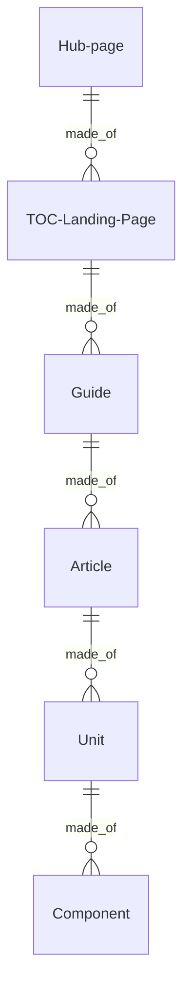
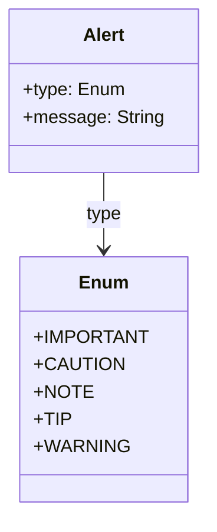
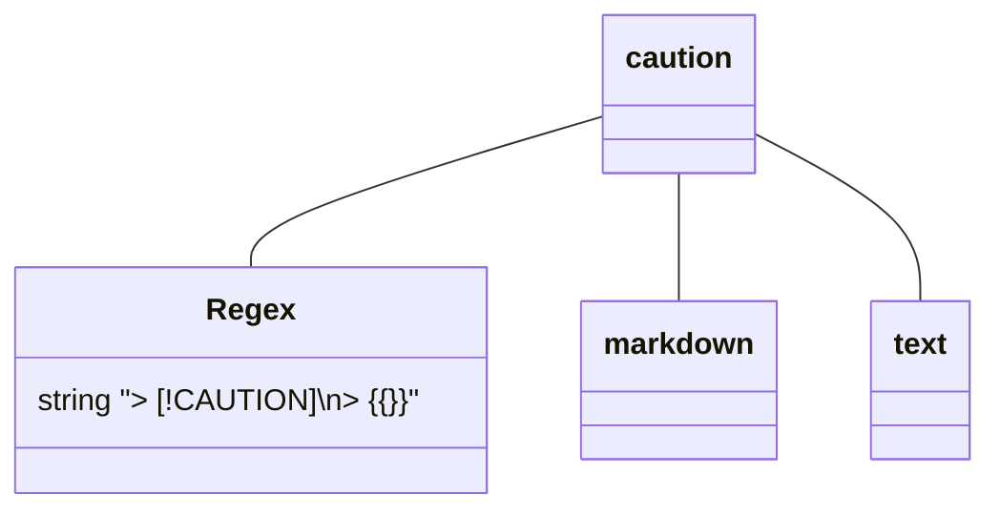
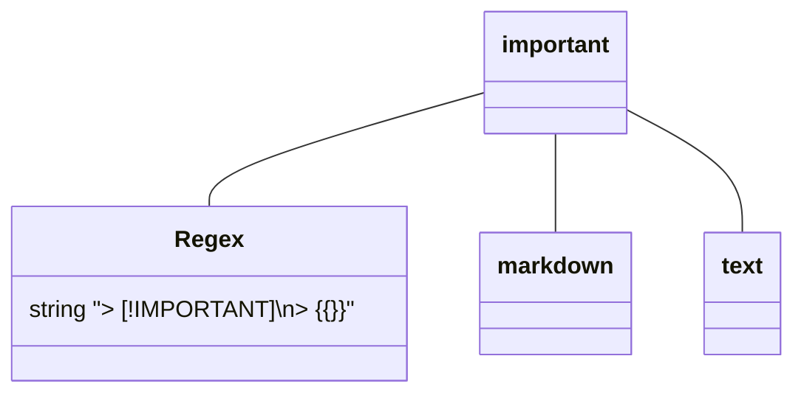
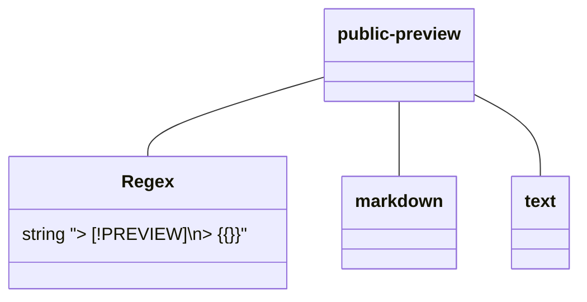
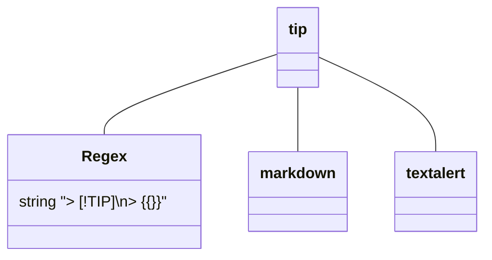
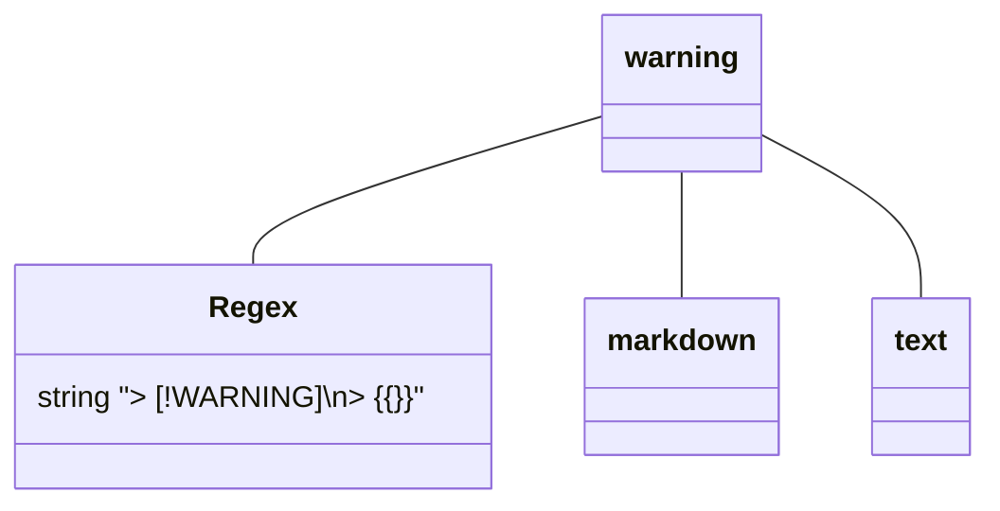
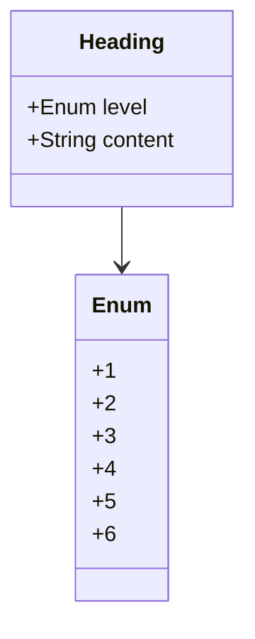

# Learn Microsoft.com Document Object Model

Content is the material that appears in the 'content well' of the learn.Microsoft.com website. This includes the table of contents and the articles (text, graphics, and videos). Current content modalities include technical documentation and training.

Content Architecture defines a subset of structures in the [Unified Content Model](https://review.learn.microsoft.com/help/patterns/library/contribute-unified-content-model) (UCM). Content Architecture fits under the [Article](https://review.learn.microsoft.com/help/patterns/library/contribute-unified-content-mode#article) section of the UCM and provides support for the Table of Contents (that is not specified in the UCM).

## Content Architecture 

The content architecture is driven by writer and user requirements through _A Pattern Language_ defined in the [Content Pattern Library](https://review.learn.microsoft.com/help/patterns/?branch=main). A [design pattern](https://www.patternlanguage.com) is a proven and repeatable solution to a writer and customer problem. These patterns are defined and presented using a modular system of documentation templates that are validated using schemas described in JSON Schema and declarative rules.

The architecture is formally described in Resource Description framework ([RDF](https://www.w3.org/RDF))/ Web Ontology Language ([OWL](https://www.w3.org/TR/owl2-syntax/)) using a domain-specific ontology approach following the best practices in the Basic Ontology Framework.

This formal description represents the concepts in the domain that includes the Content Architecture Object Model. The Content Architecture Object model is made of the objects (that can be thought of as tokens in _A Pattern Language_) and their relationships (that can be bought of the syntax of the pattern language.)

The Object Model also serves an API for systems that must integrate with the content architecture. To support these systems, the subset of objects in the ontology are described using JSON Schema and these schemas are offered through the Object Store in the Learn.Microsoft.com platform.

The objects are:

- **Hub page**: Design specification TBD
- **TOC/Landing Page**: [Design specification](https://review.learn.microsoft.com/help/patterns/program/design-pattern-library-level2?branch=main)
- **Guide**: [Design specification](https://review.learn.microsoft.com/help/patterns/program/design-pattern-library-level3)
- **Article**: [Design specification](https://review.learn.microsoft.com/help/patterns/program/design-pattern-library-level4)
- **Unit**: Design specification TBD
- **Component**: Design specification TBD

Broadly, content architecture is composed of a set of composite objects. The smallest item, a chunk of markdown, is called a component. A unit is defined as an array of components. An article is defined as an array of units. A guide is defined as an array of articles. a TOC/Landing page is defined as an array of guides. A Hub page is defined as an array of TOC/Landing pages.



For more information see:
- [Program documentation for the Content Pattern Library](https://review.learn.microsoft.com/help/patterns/program/?branch=main)
- [Microsoft Content Pattern Library documentation](https://review.learn.microsoft.com/help/patterns/?branch=main)
## Hub pages, TOCs, Guides  

An Hub page then can be described as a schema defining the array of TOCs/Landing pages. And each TOCs/Landing pages can be described as an array of guides. In turn each guide is an array of articles.

```
Hub:
    <hub metdata>    
TOCs:
    TOC 1:
    <toc metadata>
    Content:
    <toc>
        Guide 1:
        <guide metadata>
        Articles:
            <...>
    TOC 2:
    <toc metadata>
    Content:
    <toc>
        Guide 1:
        <guide metadata>
        Articles:
            <...>
    TOC 3:
    <toc metadata>
    Content:
    <toc>
        Guide 1:
        <guide metadata>
        Articles:
            <...>    
```

## Article, unit, component

An article then can be described as a schema defining the array of units. And each unit can be described as an array of components.

```
article:
  metadata
  - items:
    type:
    platformid:
  body:
  - unit:
    metadata:
    - items:
      type:
      platformid:
    body:
    - component:
      metadata:^Markdown
      - items:
        type:
        platformid:
      body:
        {{represenation}}
  - unit:
    metadata:
    - items:
      type:
      platformid:
    body:
    - component:
      metadata:
      - items:
        type:
        platformid:
      body:
        markdown: entire link pararagrph
        text: entire [link] paragrah
        link:
         href: 
         name:
```

## Components

A component can be thought of a component is an HTML block on the web site, and a JSON-LD representation for programmatic consumption of the content. To go to the beginning, the component exists as content block in HTML terms. Like HTML content blocks, a component fills the entire content column.

Components are composed of elements that are part of the definition of each component. This section looks at what a components is, and is followed by the library of components that make up the defined Content Architecture Object Model.

A component exits in several states within the system. In it's final state, the component may exist in two states:s a markdown block. The markdown block is parsed into JSON and then fed to the rendering templates that create the HTML and JSON-LD public web state of the component.

A component exists in relation to other elements of the content architecture. A unit object contains the an array of component objects. An article object contains an array of unit objects. Above the level of the article, a guide object contains an array of articles and label nodes. A TOC object contains an array of articles, labels, and articles.

The types of media that are displayed in the content well include:

- **Text blocks**: Content blocks that contains text elements are natural language parts that can be understood by a person reading the text. Text elements are not structured using purely prescriptive models, however they can be parsed into programmatic representations using a variety of techniques. NLP processing creates a syntactical model that contains attributes such a part of speech, entity recognition, sentence recognition, and so on. Vector representations convert text, sentences, and so on into a numeric coordinates. The purpose of text is to communicate information to a human reader. Textual superstructures such as modality organize text chunks with specific purposes to accomplish more complex information tasks such as teaching a reader skill or presenting information for a reader to accomplish a task. 
    - **Text**: This refers to the primary content in any written communication. In digital media, it's the sequence of words, sentences, and paragraphs that convey information or a message to the reader.
    - **Tables**: These are a means of arranging data in rows and columns, (a matrix). Tables are especially useful for presenting numerical data or information in a structured manner. A table typically consists of a header (with column names) and rows of data.
    - **Lists**: These are ordered or unordered sequences of items. Ordered lists (often represented with numbers) have a specific sequence, while unordered lists (often represented with bullets) don't emphasize any particular order
    - **Headings**: Headings are used to label sections or subsections of a text, helping to organize content and make it reader-friendly. They typically come in different levels (e.g., H1, H2, H3 in HTML) to indicate hierarchy.
    - **Inline elements**: In web design and word processing, inline elements are those that don't start on a new line and only take up as much width as necessary. They flow within the text, as opposed to block-level elements which take up the full width available. Examples include **bold** or _italicized_ text.
        - italic
        - bold
        - code
        - Hyperlinks
        - Managed terms
        - Semantic markers
- **Metadata**: Metadata is data about data. It is information that describes the characteristics of a data set, such as its size, format, and content. Metadata can also include information about the data's origin, purpose, and usage. Metadata is used to help organize, manage, and search for data, as well as to provide context for the data.
    - **Metadata about the content**. This is metadata that accompanies the content such as titles, description, and so on.
    - **Metadata related to the organization**. This metadata is related to controlled vocabularies in managed taxonomies. 
    - **Microdata**. Microdata is a type of structured data that is used to provide additional information about a web page or other online content. It is typically embedded in the HTML code of a web page and is used to provide search engines with more information about the page and its content. This can help search engines better understand the content of the page and provide more relevant search results. Microdata can also be used to provide additional information to web browsers, such as the author of the page or the date it was last updated.. 
- **Images**. An image is referenced as a content block in markdown as an image construct and in HTML as an \ element.
    - **Diagrams**: A diagram is a visual representation of information or data, usually presented in the form of a graph, chart, or illustration. It is used to convey complex ideas or concepts in a simple and easy-to-understand way. Diagrams can be used to represent relationships between different elements, or to show the flow of a process.
    - **Screenshots**: Screenshots are digital images of what is currently being displayed on a computer monitor, smartphone, or other device. They are typically taken by pressing a combination of keys or buttons on the device, and can be used to capture a specific moment in time, or to document a problem or issue with a program or device. Screenshots can also be used to share information or to show someone how to do something on a device.
    - **Conceptual art**: Conceptual art is an art form that focuses on the idea or concept behind the work, rather than the physical or visual aspects. It is often characterized by the use of unconventional materials and techniques, and is often seen as a form of protest against traditional art forms. Conceptual art often relies on the viewer to interpret the meaning behind the work, and can be seen as a form of communication between the artist and the viewer.
- **Code**: Code is a language-specific tokens that can be used in a compiler or runtime to run application. Code is a constructed language meant to communicate unambiguous instructions to a processor.
    - **Code snippet**: A code snippet is a small piece of code that can be used to perform a specific task or solve a particular problem. It is usually a short segment of code that can be used to quickly and easily add a feature or functionality to a larger program. Code snippets can be used to reduce the amount of time and effort needed to write a program, as well as to make the code more readable and maintainable.
    - **Code samples**: A code sample is a small piece of code that is used to demonstrate a programming concept or a specific syntax. It is typically used to illustrate how a particular programming language works, or to demonstrate a specific feature of a programming language. Code samples can be used to help developers learn a new language, or to help them understand a particular concept or feature.
- **Context switchers**. A context switcher is a feature of a web site interface that allows the user to switch between different contexts or views of the same web page. For example, a web page may have different views for desktop, tablet, and mobile devices. The context switcher allows the user to switch between these different views, allowing them to view the page in the context that best suits their device.
    - Zone pivots
    - Moniker (context)
    - Content tabs

Elements on the web site that are not content or are mixed with context and other concerns, are:
- Navigation elements such as breadcrumbs and site menus
- Site URL structure
- Hub pages
- Landing pages
- "Customer facing" taxonomies

# Library of defined Components in the CA object model

Components are composed of elements that are part of the definition of each component. This section defined each component that make up the defined Content Architecture Object Model.
### alert

Alerts are a Markdown extension to create block quotes that render on Microsoft Learn with colors and icons that indicate the significance of the content.

**Diagram**



**JSON Schema**

```json
{
  "$schema": "http://json-schema.org/draft-07/schema#",
  "type": "alert",
  "properties": {
    "level": {
      "type": "string",
      "enum": ["IMPORTANT", "CAUTION", "NOTE", "TIP", "WARNING"],
      "description": "The type of the message. It can be 'IMPORTANT', 'CAUTION', 'NOTE', 'TIP', or 'WARNING'."
    },
    "text": {
      "type": "string",
      "minLength": 1,
      "description": "The message conveying information about dangerous certain consequences of an action."
    }
  },
  "required": ["type", "message"]
}

```

**Parsed**

```json
{
    type: alert
    level: "Important"
    markdown: "> Important\{n>The message conveying information about dangerous certain consequences of an action."
    text: "The message conveying information about dangerous certain consequences of an action."
}
```

#### caution

Negative potential consequences of an action.

**Diagram**




```Markdown

  > [!CAUTION]
  > Negative potential consequences of an action.
```

**Parsed**

```json

{
  "$schema": "http://json-schema.org/draft-07/schema#",
  "type": "object",
  "properties": {
    "type": {
      "type": "string",
      "enum": ["CAUTION"],
      "description": "The type of the message. Currently, only 'CAUTION' is supported."
    },
    "message": {
      "type": "string",
      "minLength": 1,
      "description": "The message describing the potential consequences of an action."
    }
  },
  "required": ["type", "message"]
}


```

#### important

Definition

**Diagram**




```markdown
  > [!IMPORTANT]
  > Essential information required for user success.

```

**Parsed**

```json
{
  "$schema": "http://json-schema.org/draft-07/schema#",
  "type": "object",
  "properties": {
    "type": {
      "type": "string",
      "enum": ["IMPORTANT"],
      "description": "The type of the message. Currently, only 'IMPORTANT' is supported."
    },
    "message": {
      "type": "string",
      "minLength": 1,
      "description": "The message conveying essential information required for user success."
    }
  },
  "required": ["type", "message"]
}


#### note

Information the user should notice even if skimming.

**Diagram**

```mermaid
classDiagram

note -- Regex
note -- markdown
Regex : string "> [!NOTE]\n> {{}}"
note -- text
```


```markdown
  > [!NOTE]
  > Information the user should notice even if skimming.

```

**Parsed**

```json
{
  "$schema": "http://json-schema.org/draft-07/schema#",
  "type": "object",
  "properties": {
    "type": {
      "type": "string",
      "enum": ["NOTE"],
      "description": "The type of the message. Currently, only 'NOTE' is supported."
    },
    "message": {
      "type": "string",
      "minLength": 1,
      "description": "The message conveying information that the user should notice even if skimming."
    }
  },
  "required": ["type", "message"]
}


```

#### public-preview

Definition


**Diagram**




```markdown


```

**Parsed**

```json
type: X
level: X
markdown:
text: X
```


#### tip

Optional information to help a user be more successful.

**Diagram**




```markdown
  > [!TIP]
  > Optional information to help a user be more successful.

```

**Parsed**

```json
{
  "$schema": "http://json-schema.org/draft-07/schema#",
  "type": "object",
  "properties": {
    "type": {
      "type": "string",
      "enum": ["TIP"],
      "description": "The type of the message. Currently, only 'TIP' is supported."
    },
    "message": {
      "type": "string",
      "minLength": 1,
      "description": "The message conveying optional information to help a user be more successful."
    }
  },
  "required": ["type", "message"]
}

```

#### warning

Definition

**Diagram**




```markdown
  > [!WARNING]
  > Dangerous certain consequences of an action.
```

**Parsed**

```json
{
  "$schema": "http://json-schema.org/draft-07/schema#",
  "type": "object",
  "properties": {
    "type": {
      "type": "string",
      "enum": ["WARNING"],
      "description": "The type of the message. Currently, only 'WARNING' is supported."
    },
    "message": {
      "type": "string",
      "minLength": 1,
      "description": "The message conveying information about dangerous certain consequences of an action."
    }
  },
  "required": ["type", "message"]
}

```

### blockquote

A blockquote is used to indicate a section of text that is a quotation from another source. It visually sets the quoted text apart from the main content, making it easy for readers to recognize that the text is a quote.

**Diagram**

```mermaid
classDiagram

object

```

```markdown


```

**Parsed**

```json
type: X
level: X
markdown:
text: X
```


### blue-box-link

Definition

**Diagram**


```markdown


```

**Parsed**

```json
type: X
level: X
markdown:
text: X
```


### code-block

A Markdown code block is a section of text used to display code, commands, or other preformatted text. Unlike inline code, which is delimited by single backticks (`), a code block is delimited by triple backticks (```) or indented with four spaces. This ensures the content inside is displayed in a monospace font and is not processed as regular Markdown, preserving whitespace and special characters.

**Diagram**

```mermaid
classDiagram

object

```

**Markdown**

```markdown
  ```code-type
  code
  ```

**Parsed**

```json
type: X
level: X
markdown:
text: X
```


### component-unknown

A container for components that an inventory process can't identify as a defined component.

**Diagram**

```mermaid
classDiagram

object

```

**Markdown**

```markdown


```

**Parsed**

```json
type: X
level: X
markdown:
text: X
```


### header

Heading elements are used to define headings in HTML. They range from <h1> to <h6>, with <h1> representing the highest (or most important) level and <h6> the lowest (or least important) level.

**Diagram**



**Markdown**

**JSON Schema**

```json

```

**Parsed**

```json
type: X
level: X
markdown:
text: X
```


#### h1

Heading level 1 (# heading 1).

**Diagram**


```markdown
  # {{Title}}
```

**Parsed**

```json
{
  "$schema": "http://json-schema.org/draft-07/schema#",
  "type": "object",
  "properties": {
    "level": {
      "type": "integer",
      "enum": [1],
      "description": "The level of the heading. For '# Heading 1', the level is 1."
    },
    "content": {
      "type": "string",
      "minLength": 1,
      "description": "The text content of the heading."
    }
  },
  "required": ["level", "content"]
}

```

#### h2

Heading level 2 (# heading 2).

**Diagram**


{
  "$schema": "http://json-schema.org/draft-07/schema#",
  "type": "object",
  "properties": {
    "level": {
      "type": "integer",
      "enum": [2],
      "description": "The level of the heading. For '## Heading 2', the level is 2."
    },
    "content": {
      "type": "string",
      "minLength": 1,
      "description": "The text content of the heading."
    }
  },
  "required": ["level", "content"]
}

```


```markdown


```

**Parsed**

```json
type: X
level: X
markdown:
text: X
```


#### h3

Heading level 3 (# heading 3).

**Diagram**


{
  "$schema": "http://json-schema.org/draft-07/schema#",
  "type": "object",
  "properties": {
    "level": {
      "type": "integer",
      "enum": [3],
      "description": "The level of the heading. For '### Heading 3', the level is 3."
    },
    "content": {
      "type": "string",
      "minLength": 1,
      "description": "The text content of the heading."
    }
  },
  "required": ["level", "content"]
}

```


```markdown


```

**Parsed**

```json
type: X
level: X
markdown:
text: X
```


#### h4

Heading level 4 (# heading 4).

**Diagram**


```markdown


```

**Parsed**

```json
{
  "$schema": "http://json-schema.org/draft-07/schema#",
  "type": "object",
  "properties": {
    "level": {
      "type": "integer",
      "enum": [4],
      "description": "The level of the heading. For '#### Heading 4', the level is 4."
    },
    "content": {
      "type": "string",
      "minLength": 1,
      "description": "The text content of the heading."
    }
  },
  "required": ["level", "content"]
}

```

#### h5

Heading level 5 (# heading 5).

**Diagram**


```markdown


```

**Parsed**

```json
{
  "$schema": "http://json-schema.org/draft-07/schema#",
  "type": "object",
  "properties": {
    "level": {
      "type": "integer",
      "enum": [5],
      "description": "The level of the heading. For '##### Heading 5', the level is 5."
    },
    "content": {
      "type": "string",
      "minLength": 1,
      "description": "The text content of the heading."
    }
  },
  "required": ["level", "content"]
}

```

#### h6

Heading level 6 (# heading 6).

**Diagram**


```markdown


```

**Parsed**

```json
{
  "$schema": "http://json-schema.org/draft-07/schema#",
  "type": "object",
  "properties": {
    "level": {
      "type": "integer",
      "enum": [6],
      "description": "The level of the heading. For '###### Heading 6', the level is 6."
    },
    "content": {
      "type": "string",
      "minLength": 1,
      "description": "The text content of the heading."
    }
  },
  "required": ["level", "content"]
}

```

### image

#### diagram

Definition

**Diagram**


```markdown
  


```

**Parsed**

```json
type: X
level: X
markdown:
text: X
```


#### editorial

Definition

**Diagram**


```markdown
  


```

**Parsed**

```json
type: X
level: X
markdown:
text: X
```


#### screenshot

Definition

**Diagram**
markdown
  


```

**Parsed**

```json
type: X
level: X
markdown:
text: X
```


#### wayfinder

#### large-image

`look up the definition.`

Definition

**Diagram**


```markdown


```

**Parsed**

```json
type: X
level: X
markdown:
text: X
```


### list

These are ordered or unordered sequences of items. Ordered lists (often represented with numbers) have a specific sequence, while unordered lists (often represented with bullets) don't emphasize any particular order.

#### Nodes of a list

In HTML, a list item is represented by the `<li>` element. The `<li>` element can contain both inline-level content (phrasing content) and block-level content (flow content).

##### Flow Content (Block-level Elements):

1. **`<p>`**: Paragraphs.
2. **`<div>`**: Generic container for block-level content.
3. **`<ul>`**: Unordered list.
4. **`<ol>`**: Ordered list.
5. **`<table>`**: Table.
6. **`<blockquote>`**: Block quotation.
7. **`<pre>`**: Preformatted text.
8. **`<address>`**: Contact information.
9. **`<section>`**: Section of content.
10. **`<header>`**: Header of a section or page.
11. **`<footer>`**: Footer of a section or page.
12. **`<article>`**: Self-contained content.
13. **`<aside>`**: Content indirectly related to surrounding content.
14. **`<figure>`**: Grouping element, often used with captions.
15. **`<nav>`**: Navigation links.
16. **`<main>`**: Main content of a document.
17. **`<form>`**: Form.

##### Phrasing Content (Inline-level Elements):

18. **`<a>`**: Anchor (Hyperlink).
19. **`<span>`**: Generic inline container.
20. **`<strong>`**: Strong importance (bold).
21. **`<em>`**: Emphasized text (italic).
22. **`<b>`**: Bold text.
23. **`<i>`**: Italic text.
24. **``**: Image.
25. **`<abbr>`**: Abbreviation or acronym.
26. **`<code>`**: Inline code.
27. **`<time>`**: Time or date.
28. **`<mark>`**: Marked or highlighted text.
29. **`<small>`**: Smaller text.
30. **`<cite>`**: Title of a creative work.
31. **`<sub>` and `<sup>`**: Subscript and superscript.
32. **`<button>`**: Button.
33. **`<input>`**: Input field.
34. **`<label>`**: Label for an input element.
35. **`<select>`**: Drop-down list.
36. **`<textarea>`**: Multi-line text input.
37. **`<script>`**: Script.
38. **`<noscript>`**: Alternate content for users that have disabled scripts.

##### Text:
39. **Text Nodes**: Plain text content.

##### Example:

```html
<li>
  <p>This is a paragraph inside a list item.</p>
  <ul>
    <li>Nested list item</li>
  </ul>
</li>
```

In this example, the `<li>` element contains both block-level content (`<p>` and `<ul>`) and inline-level content (text nodes).

#### Nodes of a List (table)

Here is a table that lists the HTML nodes that can be children of a list item element (`<li>`), along with their HTML tags, Markdown syntax (where applicable), and a brief description.

| Name        | HTML Tag    | Markdown Syntax | Description                                                                   |
|-------------|-------------|-----------------|-------------------------------------------------------------------------------|
| Paragraph   | `<p>`       | `text`          | Represents a paragraph of text.                                               |
| Division    | `<div>`     | N/A             | Generic container for block-level content.                                    |
| Unordered List | `<ul>`   | `* item` or `- item` | Represents an unordered list.                                            |
| Ordered List | `<ol>`     | `1. item`       | Represents an ordered list.                                                   |
| Table       | `<table>`   | N/A             | Represents a table.                                                           |
| Block Quote | `<blockquote>`| `> text`      | Represents a block quotation.                                                |
| Preformatted Text | `<pre>` | ```text```    | Represents preformatted text.                                                |
| Address     | `<address>` | N/A             | Represents contact information.                                               |
| Section     | `<section>` | N/A             | Represents a section of content.                                              |
| Header      | `<header>`  | N/A             | Represents the header of a section or page.                                   |
| Footer      | `<footer>`  | N/A             | Represents the footer of a section or page.                                   |
| Article     | `<article>` | N/A             | Represents self-contained content.                                            |
| Aside       | `<aside>`   | N/A             | Represents content indirectly related to surrounding content.                |
| Figure      | `<figure>`  | N/A             | Represents grouped content, often used with captions.                         |
| Navigation  | `<nav>`     | N/A             | Represents a section of navigation links.                                     |
| Main        | `<main>`    | N/A             | Represents the main content of a document.                                    |
| Form        | `<form>`    | N/A             | Represents a form.                                                            |
| Anchor      | `<a>`       | `[text](URL)`   | Defines a hyperlink.                                                          |
| Span        | `<span>`    | N/A             | Generic inline container, usually for styling or scripting.                  |
| Strong      | `<strong>`  | `**text**` or `__text__` | Gives text strong importance, typically displayed as bold.               |
| Emphasis    | `<em>`      | `*text*` or `_text_` | Emphasizes text, typically displayed as italic.                           |
| Bold        | `<b>`       | `**text**` or `__text__` | Makes text bold, without any special importance.                         |
| Italic      | `<i>`       | `*text*` or `_text_` | Makes text italic, without any special importance.                         |
| Image       | ``     | `` | Represents an image.                                                     |
| Abbreviation| `<abbr>`    | N/A             | Represents an abbreviation or acronym, optionally with a title.              |
| Code        | `<code>`    | `` `text` ``     | Represents a single line of code.                                            |
| Time        | `<time>`    | N/A             | Represents a specific period in time.                                        |
| Mark        | `<mark>`    | N/A             | Represents marked or highlighted text.                                       |
| Small       | `<small>`   | N/A             | Makes text smaller, often used for disclaimers or side comments.             |
| Citation    | `<cite>`    | N/A             | Defines the title of a creative work.                                        |
| Subscript   | `<sub>`     | N/A             | Represents subscript text.                                                   |
| Superscript | `<sup>`     | N/A             | Represents superscript text.                                                 |
| Button      | `<button>`  | N/A             | Represents a clickable button.                                               |
| Input       | `<input>`   | N/A             | Represents an input field.                                                   |
| Label       | `<label>`   | N/A             | Represents a label for an `<input>` element.                                 |
| Select      | `<select>`  | N/A             | Represents a drop-down list.                                                 |
| Textarea    | `<textarea>`| N/A             | Represents a multi-line text input.                                          |
| Script      | `<script>`  | N/A             | Contains scripting statements or points to an external script file.          |
| NoScript    | `<noscript>`| N/A             | Defines alternate content for users that have disabled scripts in their browser. |

Markdown syntax is not applicable (N/A) for many HTML tags as Markdown is a simpler language focused primarily on text formatting and does not have corresponding syntax for many HTML elements.

#### bullet

Definition

**Diagram**


```markdown
  - item
  - item
  - item
```

**Parsed**

```json
type: X
level: X
markdown:
text: X
```


#### checklist

Definition

**Diagram**


```markdown
  > [!div class="checklist"]
  > * List item 1
  > * List item 2
  > * List item 3
```

**Parsed**

```json
type: X
level: X
markdown:
text: X
```


#### numbered

Definition

**Diagram**


```markdown
  1. Item
  2. Item
  3. Item

```

**Parsed**

```json
type: X
level: X
markdown:
text: X
```


### paragraph

Content blocks that contains text elements are natural language parts that can be understood by a person reading the text. Text elements are not structured using purely prescriptive models, however they can be parsed into programmatic representations using a variety of techniques. NLP processing creates a syntactical model that contains attributes such a part of speech, entity recognition, sentence recognition, and so on. Vector representations convert text, sentences, and so on into a numeric coordinates. The purpose of text is to communicate information to a human reader. Textual superstructures such as modality organize text chunks with specific purposes to accomplish more complex information tasks such as teaching a reader skill or presenting information for a reader to accomplish a task.

Text refers to the primary content in any written communication. In digital media, it's the sequence of words, sentences, and paragraphs that convey information or a message to the reader.

#### Nodes of a Text Block

In HTML, a paragraph is represented by the `<p>` element. The `<p>` element can only contain phrasing content, which is essentially a group of inline-level elements. Here are some of the valid child nodes that can be included inside a `<p>` (paragraph) element:

##### Text-level Semantic Elements:
1. **`<a>`**: Anchor element, defines a hyperlink.
2. **`<abbr>`**: Abbreviation or acronym, optionally with a title.
3. **`<b>`**: Bold text, without any special importance.
4. **`<i>`**: Italic text, without any special importance.
5. **`<span>`**: Generic inline container, usually used to apply styles or scripting.
6. **`<strong>`**: Strong importance, typically displayed as bold.
7. **`<em>`**: Emphasized text, typically displayed as italic.
8. **`<mark>`**: Marked or highlighted text.
9. **`<small>`**: Smaller text, often used for disclaimers or side comments.
10. **`<time>`**: Represents a specific period in time.
11. **`<cite>`**: Title of a creative work.
12. **`<code>`**: Inline code.
13. **`<var>`**: Variable.
14. **`<samp>`**: Sample output.
15. **`<kbd>`**: User input, typically keyboard input.
16. **`<sub>` and `<sup>`**: Subscript and superscript.
17. **`<dfn>`**: Defining instance of a term.
18. **`<q>`**: Inline quotation.
19. **`<s>`**: Text that is no longer correct or relevant.

##### Form Controls (Inline):
20. **`<button>`**: Button.
21. **`<label>`**: Label for an `<input>` element.
22. **`<input>`**: Input field, when used inline.
23. **`<select>`**: Drop-down list, when used inline.
24. **`<textarea>`**: Multi-line text input, when used inline.

##### Embedded Content:
25. **``**: Image.
26. **`<object>`**: Embedded object.
27. **`<iframe>`**: Inline frame.
28. **`<canvas>`**: Drawing area for graphics, usually manipulated with JavaScript.

##### Scripting:
29. **`<script>`**: Contains scripting statements or points to an external script file.
30. **`<noscript>`**: Defines alternate content for users that have disabled scripts.

##### Text:
31. **Text Nodes**: Plain text content.

##### Note:
- Block-level elements, such as `<div>`, `<table>`, `<ul>`, `<ol>`, `<h1>`-`<h6>`, and `<p>`, are not valid children of a paragraph and will implicitly close the `<p>` tag if they are included inside it.
- The above elements should be used inline within the paragraph. Using elements like `<textarea>`, `<select>`, and `<input>` as block elements inside a paragraph will not be valid.

#### Nodes of a Text Block (table)

The following table that lists the HTML nodes that can be children of a paragraph element, along with their HTML tags, Markdown syntax (where applicable), and a brief description.

| Name        | HTML Tag    | Markdown Syntax | Description                                                                   |
|-------------|-------------|-----------------|-------------------------------------------------------------------------------|
| Anchor      | `<a>`       | `[text](URL)`   | Defines a hyperlink.                                                          |
| Abbreviation| `<abbr>`    | N/A             | Represents an abbreviation or acronym, optionally with a title.              |
| Bold        | `<b>`       | `**text**` or `__text__` | Makes text bold, without any special importance.                         |
| Italic      | `<i>`       | `*text*` or `_text_` | Makes text italic, without any special importance.                         |
| Span        | `<span>`    | N/A             | Generic inline container, usually for styling or scripting.                 |
| Strong      | `<strong>`  | `**text**` or `__text__` | Gives text strong importance, typically displayed as bold.               |
| Emphasis    | `<em>`      | `*text*` or `_text_` | Emphasizes text, typically displayed as italic.                           |
| Mark        | `<mark>`    | N/A             | Represents marked or highlighted text.                                      |
| Small       | `<small>`   | N/A             | Makes text smaller, often used for disclaimers or side comments.            |
| Time        | `<time>`    | N/A             | Represents a specific period in time.                                        |
| Citation    | `<cite>`    | N/A             | Defines the title of a creative work.                                       |
| Code        | `<code>`    | `` `text` ``     | Represents a single line of code.                                            |
| Variable    | `<var>`     | N/A             | Represents the name of a variable.                                           |
| Sample      | `<samp>`    | N/A             | Represents sample output from a computer program.                           |
| Keyboard    | `<kbd>`     | N/A             | Represents user input, typically keyboard input.                            |
| Subscript   | `<sub>`     | N/A             | Represents subscript text.                                                   |
| Superscript | `<sup>`     | N/A             | Represents superscript text.                                                 |
| Definition  | `<dfn>`     | N/A             | Represents the defining instance of a term.                                  |
| Quote       | `<q>`       | N/A             | Defines a short inline quotation.                                            |
| Strikethrough | `<s>`     | `~~text~~`      | Represents text that is no longer correct or relevant.                       |
| Button      | `<button>`  | N/A             | Represents a clickable button.                                               |
| Label       | `<label>`   | N/A             | Represents a label for an `<input>` element.                                 |
| Input       | `<input>`   | N/A             | Represents an input field.                                                   |
| Select      | `<select>`  | N/A             | Represents a drop-down list.                                                 |
| Textarea    | `<textarea>`| N/A             | Represents a multi-line text input.                                          |
| Image       | ``     | `` | Represents an image.                                                   |
| Object      | `<object>`  | N/A             | Represents an embedded object.                                               |
| Iframe      | `<iframe>`  | N/A             | Represents an inline frame.                                                  |
| Canvas      | `<canvas>`  | N/A             | Represents a drawing area for graphics.                                      |
| Script      | `<script>`  | N/A             | Contains scripting statements or points to an external script file.          |
| NoScript    | `<noscript>`| N/A             | Defines alternate content for users that have disabled scripts in their browser. |

Markdown syntax is not applicable (N/A) for many HTML tags as Markdown is a simpler language focused primarily on text formatting and does not have corresponding syntax for many HTML elements.

**Diagram**


```markdown
{{paragraph-text}}

```s

**Parsed**

```json
type: X
level: X
markdown:
text: X
```


### selector

`definition coming from Bobby.`

### table

These are a means of arranging data in rows and columns, (a matrix). Tables are especially useful for presenting numerical data or information in a structured manner. A table typically consists of a header (with column names) and rows of data.

**Diagram**


```markdown
  |This is   |a simple   |table header|
  |----------|-----------|------------|
  |table     |data       |here        |
  |it doesn't|actually   |have to line up nicely!|

```

**Parsed**

```json
type: X
level: X
markdown:
text: X
```


### video

Definition

**Diagram**


```markdown
  > [!VIDEO <embedded_video_link>]

```

**Parsed**

```json
type: X
level: X
markdown:
text: X
```

