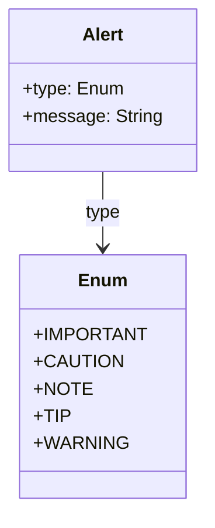

### alert

Alerts are a Markdown extension to create block quotes that render on Microsoft Learn with colors and icons that indicate the significance of the content.

Alerts include:
- caution
- important
- note
- public-preview
- tip
- warning

#### Diagram

The following diagram displays the set of possible sub-elements of the component.



#### Example markdown

The following markdown is an example of the artifact in a file.

```md
  > [!CAUTION]
  > Negative potential consequences of an action.
```

#### JSON parsed object

The following JSON represents the attributes of a parsed artifact.

```json
{
	"type": "alert",
	"level": "Important",
	"markdown": "  > [!CAUTION]\r\n  > Negative potential consequences of an action.",
	"text": "The message conveying information about dangerous certain consequences of an action."
}
```

#### JSON Schema for a parsed object

```json
{
  "$schema": "http://json-schema.org/draft-04/schema#",
  "type": "object",
  "properties": {
    "type": {
      "type": "string"
    },
    "level": {
      "type": "string"
      "enum": ["IMPORTANT", "CAUTION", "NOTE", "TIP", "WARNING"],
      "description": "The type of the message. It can be 'IMPORTANT', 'CAUTION', 'NOTE', 'TIP', or 'WARNING'."
    },
    "markdown": {
      "type": "string"
    },
    "text": {
      "type": "string"
      "minLength": 1,
      "description": "The message conveying information about dangerous certain consequences of an action."
    }
  },
  "required": [
    "type",
    "level",
    "markdown",
    "text"
  ]
}

```