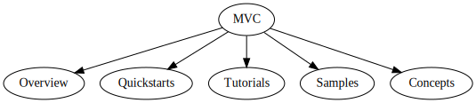

# Title: MVC content set

## Version:
1.0.0

## Context:
In Azure technical documentation to published, in general, to docs.microsoft.com/en-us/azure/, content required similar structures. This structure of top level elements of the table of content followed a specific order and became a requirement for docs to be published.

## Pattern category:
DocSet, Docs

## Problem:
Azure documentation used inconsistent organization from content set to content set resulting in confusion in readers quickly looking for information in Azure content. Content sets didn't share an approach to content presentation or publishing shared types of information.

## Intent:
Content published using the MVC content set pattern uses the same content organization and collection of content types so that readers can find the information they are looking for when browsing different services in Azure.

## Diagram: 

## Consequence:
Content sets using the pattern follow the same level one structure.

## Rational:
The pattern provides a prescriptive and rigid structure that can be mechanically validated. The pattern supports a consistent presentation of content at the highest level.

## Related patterns:
Guide: Overview, Guide: Quickstarts, Guide: Tutorials, Guide: Samples, Guide: Concepts

## Authors:
Kris Crider 

## Revisions:
The history of the versions of the pattern document.
[https://github.com/MicrosoftDocs/docs-help-pr/commits/main/help-content/contribute/contribute-get-started-mvc.md](https://github.com/MicrosoftDocs/docs-help-pr/commits/main/help-content/contribute/contribute-get-started-mvc.md)

## Notes:
[https://review.docs.microsoft.com/en-us/help/contribute/contribute-get-started-mvc?branch=main](https://github.com/MicrosoftDocs/docs-help-pr/commits/main/help-content/contribute/contribute-get-started-mvc.md)
This will likely be a legacy pattern. However the pattern is currently defined in the _Contributor Guide_. In many ways this is a good pattern to critique since it may not meet the needs of someone looking for a pattern. It meets the needs of the org, but not the person creating the content set.

[Top](index.md) | [Microsoft content pattern library](https://review.docs.microsoft.com/en-us/help/patterns/?branch=patterns)