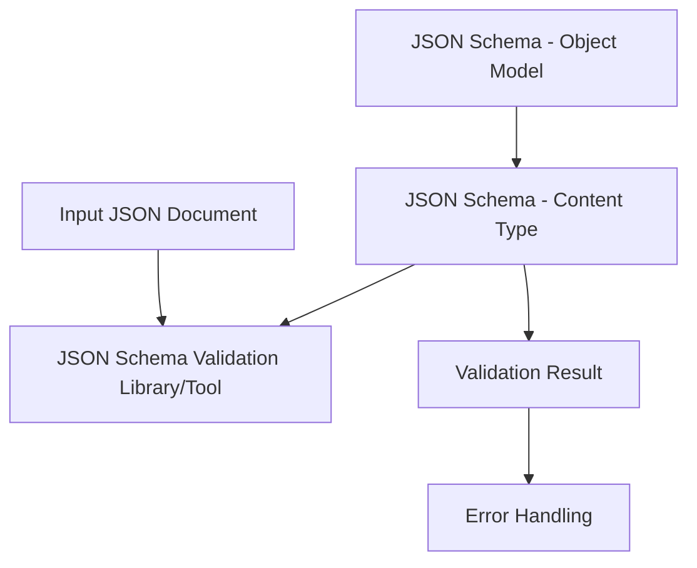

# Sketch of requirements for Skilling rules

This document is a sketch of the requirements and the rules for content types managed my the Content Architecture team in the Skilling organization at Microsoft.

The Skilling rules must accommodate a variety of media types, such as bitmapped graphics (`png`), markdown files (`md`), `yaml` files, video binaries (`mp4`). In addition the validation rules are documents stored in a governed version control repository. As documents they must be human and machine readable and use a flexible and documented format. The rules must be useable by multiple clients using a validation pipelines.

## Overview of the validation requirements

The validation pipeline is based on common standards using a machine and human readable document type (JSON) with a wide set of tools supporting common coding languages. Specifically the pipeline uses JSON and JSON Schema. For the purpose of this specification, rules will focus on markdown. However, this pipeline could be adapted to any parser that had meet the following criteria:

- Produces a JSON object as a representation of the source object. For instance, a parser could render a video binary as a JSON object.
- A media object model describes every possible valid expression of the media. For instance, markdown files inherits properties from a JSON object representing the Document Object Model.
- A JSON Schema can describes the specific validation rules associated with a content type that is an instance of the media object model.

Using an object model described in JSON and JSON Schema for a validation pipeline involves several steps. The following diagram shows the validation pipeline using JSON and JSON Schema:



Explanation of the diagram:

| Step | Description |
| --- | --- |
| A  |  input JSON document that needs to be validated. |
| B  |  base JSON Schema representing the Document Object Model for markdown files. |
| C  |  JSON Schema that defines the specific content type and validation rules. |
| D  |  JSON Schema validation library/tool that performs the actual validation against the JSON Schema. |
| E  |  validation result, which can be a boolean (true or false) or a detailed report with validation errors. |
| F  |  error handling step, where the validation errors are handled according to the defined error handling strategy. |

This diagram illustrates the basic flow of a validation pipeline using JSON and JSON Schema. The input JSON document and the JSON Schema are passed to the JSON Schema validation library/tool, which performs the validation and produces a validation result. The validation result can be used to handle errors according to the defined error handling strategy, such as logging, displaying error messages, or taking other appropriate actions.

## Overview of the process

1. **Define the object model in JSON**

    First, you need to define the object model you want to validate using JSON. JSON (JavaScript Object Notation) is a lightweight data interchange format that is easy to read and write. You can define your object model by creating a JSON document that represents the structure and properties of the object you want to validate. For example, if you're validating a user object with properties like name, email, and age, you would create a JSON document that represents this structure.

1. **Create a JSON Schema**

    JSON Schema is a standard for describing the structure, format, and validation rules for JSON documents. It provides a way to define the expected structure and properties of a JSON object, as well as specify validation rules for each property. You can create a JSON Schema that corresponds to your object model by defining the expected properties, their types, and any validation rules using the JSON Schema syntax. JSON Schema allows you to specify constraints such as required fields, allowed values, maximum and minimum lengths, and more.

1. **Integrate JSON Schema into your validation pipeline**

    Once you have created a JSON Schema for your object model, you can integrate it into your validation pipeline. A validation pipeline is a series of steps that a JSON document goes through to ensure it meets the specified validation rules. Depending on your application's requirements, your validation pipeline may include steps such as data extraction, data transformation, and data validation. You can add a validation step to your pipeline that involves validating the JSON document against the JSON Schema you created. This step typically involves parsing the JSON document and validating it against the JSON Schema using a JSON Schema validation library or tool.

1. **Perform validation**

    When a JSON document is passed through the validation pipeline, the JSON Schema is used to validate the document against the defined object model and validation rules. The JSON document is compared against the JSON Schema, and any validation errors are flagged. For example, if a required field is missing or a property has an invalid value, the validation step will raise an error or return a validation report indicating the issues found in the JSON document. This allows you to ensure that the JSON document adheres to the expected structure and validation rules defined in the JSON Schema.

1. **Handle validation results**

    Once the validation is complete, you can handle the validation results according to your application's requirements. If the JSON document passes validation, you can continue processing it in your application. If validation errors are detected, you can handle them based on your application's error handling strategy. This may involve rejecting the document, logging the errors, or taking other appropriate actions.

1. **Schema**

    Using an object model described in JSON and JSON Schema for a validation pipeline provides a standardized and flexible way to validate JSON documents against a defined structure and validation rules. It helps ensure that the input data meets the expected requirements and can improve the quality and reliability of your application's data processing.

### A list of resources needed to support this workflow

Here's a list of resources that may be needed to support the workflow of using an object model described in JSON and JSON Schema for a validation pipeline

1. **JSON Schema specification**

    Familiarity with the JSON Schema specification is essential, as it provides the syntax and rules for defining JSON object models and validation rules. The official JSON Schema website (https
    
    [json-schema.org](json-schema.org) is a valuable resource for documentation, examples, and reference materials.

1. **JSON Schema validation library/tool**

    You'll need a JSON Schema validation library or tool to perform the actual validation against the JSON Schema. There are several popular libraries and tools available in different programming languages, such as jsonschema for Python, ajv for JavaScript, and Newtonsoft.Json.Schema for .NET. These libraries/tools provide APIs or command-line interfaces for parsing JSON documents and validating them against a JSON Schema.

1. **JSON editor**

    A JSON editor can be helpful for creating and editing JSON documents and JSON Schema. There are many free and paid JSON editors available, such as JSONEdit, JSONLint, and Visual Studio Code with JSON extensions. These editors provide features like syntax highlighting, code completion, and validation to help you create and edit JSON documents and JSON Schema more efficiently.

1. **Documentation and tutorials**

    Documentation and tutorials related to JSON Schema and JSON validation can be valuable resources for understanding the concepts, syntax, and best practices involved in using JSON Schema for validation. Many online platforms, websites, and blogs provide comprehensive documentation and tutorials on JSON Schema, along with examples and use cases that can help you learn and implement the validation pipeline effectively.

1. **Testing data**

    Having sample JSON documents that represent different scenarios and edge cases can be useful for testing your validation pipeline. You can use these sample JSON documents to validate against your JSON Schema and verify that your validation pipeline behaves as expected in various scenarios. You can create your own testing data or find publicly available datasets online that align with your object model and validation rules.

1. **Error handling strategy**

    Having a well-defined error handling strategy in place is crucial for handling validation errors effectively. Depending on your application's requirements, you may need to define error codes, error messages, logging mechanisms, and other error handling strategies to handle validation errors in a consistent and meaningful way. Planning and implementing error handling in your validation pipeline is an important part of the overall workflow.

1. **Development environment**

    You'll need a development environment that supports the programming language you're using for your validation pipeline. This may include an integrated development environment (IDE), a text editor, a command-line interface, or other tools that are compatible with your chosen programming language.
    
    These are some of the key resources that may be needed to support the workflow of using an object model described in JSON and JSON Schema for a validation pipeline. The specific resources required may vary depending on your application's requirements, programming language, and development environment.

## Use the structure of the Document Object Model (DOM) as an API

There are several reasons why using the structure of the Document Object Model (DOM) as an API can be beneficial:

1. **Familiarity**

    Many web developers are already familiar with the DOM, as it is the standard programming interface for manipulating HTML and XML documents in web browsers. Using the DOM structure as an API allows developers to leverage their existing knowledge and skills, making it easier to work with and manipulate the document structure programmatically.

2. **Accessibility**

    The DOM provides a way to programmatically access and manipulate the content of a web page, including its elements, attributes, and text. This enables developers to create more accessible web applications by dynamically updating the DOM to provide alternative content, such as screen reader-friendly text or keyboard accessible controls, based on user interactions or other events.

3. **Flexibility**

    The DOM structure is hierarchical, allowing for easy traversal and manipulation of the document tree. This flexibility enables developers to perform a wide range of operations on the document, such as adding, deleting, or modifying elements, attributes, and text. This makes the DOM structure a powerful tool for building dynamic and interactive web applications.

4. **Interoperability**

    The DOM is a standard API that is supported by all modern web browsers, making it highly interoperable across different platforms and devices. This means that code written using the DOM structure as an API can be easily ported and run on different web browsers, making it a reliable and widely compatible solution for web development.

5. **Extensibility**

    The DOM structure can be extended to support custom data structures or document types, allowing developers to create their own domain-specific APIs for working with specialized documents or data formats. This extensibility makes the DOM structure a versatile and adaptable solution for various use cases beyond traditional web development.

Using the structure of the DOM as an API provides developers with a familiar, accessible, flexible, interoperable, and extensible way to programmatically interact with web documents, making it a valuable choice for building modern web applications.

## Considerations of reating an API that uses the Document Object Model (DOM)

1. **Define Purpose**

    Clearly define the purpose and scope of the API. What specific tasks or operations will the API perform using the DOM? Identify the intended use cases and target audience for the API.

1. **Choose Programming Language**

    Decide on the programming language in which you will implement the API. The DOM is typically used with languages such as JavaScript, Python, Java, or C#, depending on the context and environment of your application.

1. **Define API Methods**

    Determine the specific methods and functions that your API will provide for working with the DOM. This may include methods for creating, modifying, and deleting DOM elements, manipulating attributes and text, and navigating the document tree.

1. **Define Input/Output Formats**

    Specify the input and output formats for your API. This includes the data formats that the API will accept as input (e.g., JSON, XML) and the formats in which it will return data (e.g., JSON, XML, plain text).

1. **Define Error Handling**

    Define how your API will handle errors and exceptions that may occur during DOM manipulation. This may include defining error codes, error messages, and error handling mechanisms such as try-catch blocks or error callbacks.

1. **Define Security Measures**

    Consider security measures for your API, such as input validation, authentication, and authorization mechanisms, to ensure that only authorized users can access and manipulate the DOM.

1. **Document Usage and Examples**

    Provide thorough documentation for developers to understand how to use your API effectively. Include usage instructions, examples, and code snippets that demonstrate how to interact with the DOM using your API.

1. **Test and Debug**

    Thoroughly test and debug your API to ensure its functionality and reliability. Use testing tools, frameworks, and techniques to identify and fix any issues or bugs.

1. **Follow Best Practices**

    Follow best practices for API design, such as using descriptive and consistent naming conventions, adhering to RESTful or other API design principles, and considering performance, scalability, and maintainability of your API.

1. **Consider Versioning**

    Consider versioning your API to allow for future updates and changes without breaking existing client applications. Include versioning information in your API documentation and implement backward compatibility strategies as needed.

By considering these requirements, you can create a well-designed and robust API that leverages the power and flexibility of the DOM for interacting with web documents in a consistent and efficient manner.

The Document Object Model (DOM) does not have a specific syntax tree, as it is a programming interface that represents the structure and content of an HTML or XML document as a tree-like structure in memory. The DOM provides a set of objects and methods that allow developers to access, manipulate, and update the elements, attributes, and content of a document.

However, some libraries or tools that work with the DOM may provide a representation of the DOM as a syntax tree for specific purposes, such as parsing or manipulating the document's structure. For example, when parsing an HTML or XML document using a parser library in a programming language like JavaScript or Python, the parsed document may be represented as a tree-like structure with nodes and edges that represent the elements, attributes, and text content of the document. This tree-like structure can be considered as a "syntax tree" in the context of the specific parser or tool being used.

It's important to note that the syntax tree representation of the DOM may vary depending on the library or tool being used, and it may not be a direct representation of the actual DOM as specified by the DOM standard. It's always recommended to refer to the documentation and specifications of the specific library or tool being used to understand how it represents the DOM as a syntax tree, if applicable.

## Overview of the process

To create a JSON Schema document to validate the specific markdown content type described in your example, you can follow these steps in Python.

1. Define the schema using the JSON Schema syntax: You can create a Python dictionary that represents the JSON Schema for the markdown content type. Here's an example schema based on the provided markdown template:

    ```python
    schema = {
    "$schema": "http://json-schema.org/draft-07/schema#",
    "type": "object",
    "properties": {
        "title": {"type": "string"},
        "description": {"type": "string"},
        "author": {"type": "string"},
        "ms.author": {"type": "string"},
        "ms.service": {"type": "string"},
        "ms.topic": {"type": "string", "enum": ["concept-article"]},
        "ms.date": {"type": "string", "format": "date"},
        "ms.custom": {"type": "string", "enum": ["template-concept"]},
    },
    "required": [
        "title",
        "description",
        "author",
        "ms.author",
        "ms.service",
        "ms.topic",
        "ms.date",
        "ms.custom"
    ],
    "additionalProperties": False
    }
    ```

2. Use a JSON Schema validation library: You can use a JSON Schema validation library in Python, such as jsonschema, to validate a markdown document against the defined schema. Here's an example code snippet:

    ```python
    import jsonschema
    
    # Load the markdown document from a file or string
    markdown_doc = """
    ... # Your markdown content here
    ...
    """
    
    # Parse the markdown document into a Python dictionary
    markdown_dict = {
        "title": "Page Title",
        "description": "Article description",
        "author": "Your GitHub user alias",
        "ms.author": "Microsoft alias of author",
        "ms.service": "Service per approved list",
        "ms.topic": "concept-article",
        "ms.date": "mm/dd/yyyy",
        "ms.custom": "template-concept"
        # Add other key-value pairs as needed
    }
    
    # Validate the markdown dictionary against the schema
    jsonschema.validate(markdown_dict, schema)
    
    ```

> [!NOTE]
> You may need to install the jsonschema library using pip or any other package manager before using it in your Python environment. You can add it to your requirements.txt file as mentioned earlier in this chat.

3. Handle validation errors: If the markdown document does not conform to the defined schema, the jsonschema library will raise a jsonschema.ValidationError exception with details about the validation error. You can catch this exception and handle the validation errors accordingly in your Python code.

## Representing content as a JSON object using the Document Object Model (DOM) structure

Document templates for the Skilling organization can be represented as JSON objects.

```marmaid
graph LR
    A[document] --> B[heading]
    A --> C[paragraph]
    A --> D[heading]
    A --> E[heading]
    A --> F[heading]
    A --> G[heading]
    A --> H[list]
    H --> I[link]
    H --> J[link]
    ```

In this graph, A represents the root of the JSON object, which is the document element. B, C, D, E, F, and H represent the various elements within the document element, such as headings, paragraphs, and lists. I and J represent the link elements within the list element.

The arrows indicate the relationships between the elements, showing how they are nested within each other in the JSON object. For example, the heading elements are children of the document element, and the link elements are children of the list element.

Represent the following markdown document using the DOM represented as a JSON object as a JSON object.

```md
# [H1 heading here]

[add your introductory paragraph]

## [Section 1 heading]

## [Section 2 heading]

## [Section n heading]


## Next steps

- [Write concepts](article-concept.md)
- [Links](../contribute/links-how-to.md)
```

An example representation of the given markdown document as a JSON object using the Document Object Model (DOM) structure

```json
{
  "type": "document",
  "content": [
    {
      "type": "heading",
      "level": 1,
      "text": "H1 heading here"
    },
    {
      "type": "paragraph",
      "text": "add your introductory paragraph"
    },
    {
      "type": "heading",
      "level": 2,
      "text": "Section 1 heading"
    },
    {
      "type": "heading",
      "level": 2,
      "text": "Section 2 heading"
    },
    {
      "type": "heading",
      "level": 2,
      "text": "Section n heading"
    },
    {
      "type": "heading",
      "level": 2,
      "text": "Next steps"
    },
    {
      "type": "list",
      "items": [
        {
          "type": "link",
          "text": "Write concepts",
          "url": "article-concept.md"
        },
        {
          "type": "link",
          "text": "Links",
          "url": "../contribute/links-how-to.md"
        }
      ]
    }
  ]
}

In this representation, each element in the markdown document, such as headings, paragraphs, and links, is represented as a JSON object with a type property indicating the type of element, and additional properties as needed to capture the relevant information, such as the text content, heading level, and URL. The JSON object is structured as a tree-like structure, with nested objects representing the hierarchical relationships between the elements in the markdown document.

```

## Example Document object model (DOM) as a JSON object

In this example, the DOM is represented as a JSON object with nested objects and arrays. Each node in the DOM is represented as an object with properties such as "tagName" for the HTML tag name, "attributes" for the HTML attributes, and "children" for the child nodes. Text nodes are represented with "nodeType" set to "text" and "nodeValue" containing the text content. This JSON representation can be used for various purposes, such as parsing and manipulating HTML content in a programmatic way.

For example: [Example](example-dom.json)

```json
{
    "tagName": "html",
    "attributes": {},
    "children": [
      {
        "tagName": "head",
        "attributes": {},
        "children": [
          {
            "tagName": "title",
            "attributes": {},
            "children": [
              {
                "nodeType": "text",
                "nodeValue": "Example Title"
              }
            ]
          }
        ]
      },
      {
        "tagName": "body",
        "attributes": {},
        "children": [
          {
            "tagName": "h1",
            "attributes": {},
            "children": [
              {
                "nodeType": "text",
                "nodeValue": "Hello, World!"
              }
            ]
          },
          {
            "tagName": "p",
            "attributes": {
              "class": "example"
            },
            "children": [
              {
                "nodeType": "text",
                "nodeValue": "This is an example paragraph."
              }
            ]
          },
          {
            "tagName": "ul",
            "attributes": {},
            "children": [
              {
                "tagName": "li",
                "attributes": {},
                "children": [
                  {
                    "nodeType": "text",
                    "nodeValue": "Item 1"
                  }
                ]
              },
              {
                "tagName": "li",
                "attributes": {},
                "children": [
                  {
                    "nodeType": "text",
                    "nodeValue": "Item 2"
                  }
                ]
              },
              {
                "tagName": "li",
                "attributes": {},
                "children": [
                  {
                    "nodeType": "text",
                    "nodeValue": "Item 3"
                  }
                ]
              }
            ]
          }
        ]
      }
    ]
  }
  
```


## HTML tokens in the Document object model

The following that lists some common values used for "tagName" when representing the DOM as a JSON object, along with the corresponding HTML token, a description of its purpose, and the "nodeType" associated with it:

| tagName    | HTML token | Description                                                                                                              | nodeType |
|------------|------------|--------------------------------------------------------------------------------------------------------------------------|----------|
| "html"     | `<html>`     | Represents the root element of an HTML document.                                                                         | -        |
| "head"     | `<head>`     | Represents the head section of an HTML document, which contains meta-information about the document.                     | -        |
| "title"    | `<title>`    | Represents the title of an HTML document, typically displayed in the title bar or tab of a web browser.                  | "text"   |
| "base"     | `<base>`     | Represents a base URL for all relative URLs in the document.                                                             | -        |
| "link"     | `<link>`     | Represents an external resource link, such as a stylesheet or a favicon.                                                 | -        |
| "style"    | `<style>`    | Represents a block of CSS styles that can be applied to an HTML document.                                                | "text"   |
| "body"     | `<body>`     | Represents the body section of an HTML document, which contains the main content of the document.                        | -        |
| "h1"       | `<h1>`       | Represents a heading level 1 element, used to define the main heading of a section or page.                              | "text"   |
| "h2"       | `<h2>`       | Represents a heading level 2 element, used to define a secondary heading of a section or page.                           | "text"   |
| "h3"       | `<h3>`       | Represents a heading level 3 element, used to define a tertiary heading of a section or page.                            | "text"   |
| "h4"       | `<h4>`       | Represents a heading level 4 element, used to define a quaternary heading of a section or page.                          | "text"   |
| "h5"       | `<h5>`       | Represents a heading level 5 element, used to define a quinary heading of a section or page.                             | "text"   |
| "h6"       | `<h6>`       | Represents a heading level 6 element, used to define a senary heading of a section or page.                              | "text"   |
| "p"        | `<p>`        | Represents a paragraph element, used to define a paragraph of text.                                                      | "text"   |
| "br"       | `<br>`       | Represents a line break, used to create a line break within a text block.                                                | -        |
| "hr"       | `<hr>`       | Represents a horizontal rule, used to create a horizontal line to separate content.                                      | -        |
| "a"        | `<a>`        | Represents an anchor element, used to create hyperlinks to other web pages or resources.                                 | "text"   |
| "img"      | ``      | Represents an image element, used to display images on a web page.                                                       | -        |
| "input"    | `<input>`    | Represents an input element, used to create various types of form controls, such as text input, checkboxes, and buttons. | -        |
| "textarea" | `<textarea>` | Represents a textarea element, used to create a multi-line text input control.                                           | "text"   |
| "select"   | `<select>`   | Represents a select element, used to create a drop-down list of options for user selection.                              | -        |

## JSON Schema

Here's an example of a JSON schema that can be used to specify the Document Object Model (DOM) as a JSON object:

```JSON
{
  "$schema": "http://json-schema.org/draft-07/schema#",
  "type": "object",
  "properties": {
    "tagName": { "type": "string" },
    "attributes": {
      "type": "object",
      "additionalProperties": { "type": "string" }
    },
    "children": {
      "type": "array",
      "items": { "$ref": "#" }
    },
    "textContent": { "type": "string" }
  },
  "required": ["tagName"],
  "additionalProperties": false
}

```

The following table explains the attributes of the JSON schema

| Attribute | Explanation |
| --- | --- |
| $schema | Specifies the JSON schema version being used. |
| type | Specifies the type of the JSON object, which should be "object" in this case. |
| properties | Defines the properties that can be present in the JSON object. |
| tagName | Represents the tag name of the HTML element as a string. |
| attributes | Represents the attributes of the HTML element as an object, where the keys are the attribute names and the values are the attribute values, both represented as strings. |
| children | Represents the child elements of the HTML element as an array, where each child element is represented as another JSON object that conforms to the same schema (using $ref to reference the same schema). |
| textContent | Represents the text content of the HTML element as a string. |
| required | Specifies that the "tagName" property is required in the JSON object. |
| additionalProperties | Specifies that no additional properties are allowed in the JSON object, meaning only the properties defined in the schema are allowed. |

## How to use the JSON schema to validate a JSON document

Here are the general steps to use a JSON schema to validate a JSON document:

Step 1: Obtain a JSON schema: You can either create your own JSON schema or use an existing one that matches your requirements. In this case, you can use the JSON schema provided in the previous response.

Step 2: Choose a JSON schema validator: There are several JSON schema validators available in various programming languages. Choose a JSON schema validator that is compatible with the programming language you are using. Some popular options include Ajv for JavaScript, jsonschema for Python, and Newtonsoft.Json.Schema for C#.

Step 3: Load the JSON schema: Load the JSON schema into your programming environment or application. This typically involves reading the JSON schema from a file or a string, and parsing it into a data structure that can be used by the JSON schema validator.

Step 4: Load the JSON document: Load the JSON document that you want to validate into your programming environment or application. This typically involves reading the JSON document from a file or a string, and parsing it into a data structure that can be validated against the JSON schema.

Step 5: Validate the JSON document against the JSON schema: Use the JSON schema validator to validate the JSON document against the loaded JSON schema. This typically involves passing the JSON document and the JSON schema to a validation function provided by the JSON schema validator, and checking the validation result.

Step 6: Interpret the validation result: The validation result will typically indicate whether the JSON document is valid or not, based on the rules defined in the JSON schema. If the JSON document is valid, you can proceed with using it in your application. If the JSON document is not valid, you can handle the validation errors according to your application's requirements.

## Use Python to validate a JSON document using the JSON schema

You will use the 

### Install your requirements

You can create a requirements.txt file by following these steps:

1. Open a text editor or an integrated development environment (IDE) that supports plain text editing.
2. Create a new file and name it requirements.txt.
3. Copy and paste the example requirements.txt the following:
    ```makefile
    jsonschema==3.3.0
    ```
4. Save the requirements.txt file.
5. You can then use this requirements.txt file to install the jsonschema library and its dependencies using a package manager like pip by running the following command in your Python environment:
    ```bash
    pip install -r requirements.txt
    ```

This will install the jsonschema library with the specified version (3.3.0 in this case) and make it available for use in your Python code for JSON validation.

### Run the script to validate a markdown file

Here's an example of how you can use the jsonschema library in Python to validate a JSON document against the JSON schema.

```Python
import jsonschema

# Step 1: Obtain the JSON schema
json_schema = {
  # JSON schema here
}

# Step 2: Load the JSON document
json_document = {
  # JSON document here
}

# Step 3: Validate the JSON document against the JSON schema
try:
    jsonschema.validate(json_document, json_schema)
    print("JSON document is valid.")
except jsonschema.ValidationError as e:
    print("JSON document is not valid.")
    print(e.message)  # Validation error message
```

## Use Python to convert a markdown file into a JSON document using the DOM schema

 You can use a Python script that will convert a markdown file into a JSON document that uses the JSON schema for the DOM represented as a JSON object.

The following are the requirements:

```makefile
jsonschema==3.3.0
markdown==3.3.6
```

This requirements.txt file includes the jsonschema library for JSON validation and the markdown library for converting markdown to HTML. You can use this requirements.txt file to install the necessary dependencies using pip or any other package manager in your Python environment before running the Python script.

This is a Python script that uses the markdown and `json` libraries to convert a markdown file into a JSON document, using the JSON schema for the DOM represented as a JSON object as specified in these documents.

```python

import json
import markdown

# Step 1: Load the markdown file
with open('input.md', 'r') as f:
    markdown_content = f.read()

# Step 2: Convert the markdown to HTML
html_content = markdown.markdown(markdown_content)

# Step 3: Define the JSON document structure
json_document = {
    "tagName": "html",
    "children": [
        {
            "tagName": "head",
            "children": [
                {
                    "tagName": "title",
                    "textContent": "Document Title",
                    "nodeType": 1
                }
            ],
            "nodeType": 1
        },
        {
            "tagName": "body",
            "children": [
                {
                    "tagName": "p",
                    "textContent": html_content,
                    "nodeType": 1
                }
            ],
            "nodeType": 1
        }
    ],
    "nodeType": 1
}

# Step 4: Validate the JSON document against the JSON schema
# (Assuming the JSON schema is already defined as `json_schema`)

# json_schema = { ... }  # JSON schema here

# Uncomment the above line and replace `...` with your JSON schema

# Use jsonschema.validate() to validate the json_document against the json_schema
# Example: jsonschema.validate(json_document, json_schema)

# Step 5: Save the JSON document to a file
with open('output.json', 'w') as f:
    json.dump(json_document, f, indent=2)

print("Markdown file converted to JSON successfully!")

```

 In this example, the markdown library is used to convert the markdown content to HTML before embedding it in the JSON document. The JSON schema for the DOM represented as a JSON object is assumed to be defined as json_schema in the script. You can replace ... with your actual JSON schema in the script to perform validation using the jsonschema library as described in the previous responses. Also, please make sure to install the markdown library using pip or any other package manager before running this script, if it's not already installed in your Python environment.

## Use Python to generate a markdig presentation

 a sample Python code snippet that demonstrates how you can parse markdown using the markdig library and generate a JSON representation of the DOM. Here's an example:

```python
from markdig import Markdown
from markdig.extensions import Extension
import json

# Define a custom extension to generate a JSON representation of the DOM
class DomExtension(Extension):
    def __init__(self):
        self.tree = {}

    def extendMarkdown(self, md):
        # Override the default handling of elements
        md.treeprocessors.register(DomTreeProcessor(self.tree), 'dom', 1)

class DomTreeProcessor:
    def __init__(self, tree):
        self.tree = tree

    def __call__(self, root):
        # Recursively build the DOM tree
        self.tree = self.buildDomTree(root)

    def buildDomTree(self, node):
        if not node.children:
            # Base case: leaf node
            return {'type': node.t, 'text': node.literal}

        # Recursive case: non-leaf node
        children = []
        for child in node.children:
            children.append(self.buildDomTree(child))

        return {'type': node.t, 'children': children}

# Create an instance of the Markdown parser with the custom DomExtension
markdown = Markdown(extensions=[DomExtension()])

# Parse the markdown content
markdown_content = """
# [H1 heading here]

[add your introductory paragraph]

## [Section 1 heading]

## [Section 2 heading]

## [Section n heading]


## Next steps

- [Write concepts](article-concept.md)
- [Links](../contribute/links-how-to.md)
"""
dom_tree = markdown.convert(markdown_content)

# Convert the DOM tree to JSON
json_dom = json.dumps(dom_tree, indent=2)

# Print the JSON representation of the DOM tree
print(json_dom)

```

Please note that this is a simplified example and may not cover all possible scenarios or edge cases. The actual implementation may vary depending on your specific requirements and the structure of the markdown content you are parsing. It's important to refer to the documentation of the markdig library for detailed usage instructions and customization options.