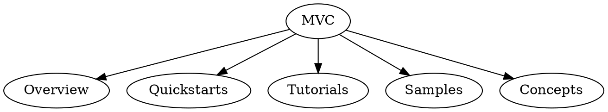

# {{pattern}} pattern definition

## Version

Version 0.0.0.

## Context

In what situation would a writer use this pattern.

## Pattern category

### Level

[level2, level3, level4]

### Modality

[Docs, Training]

## Problem

Write a problem description the situation that was encountered. Describe the 
audience and authors expectation. Explain why the problem exists for the 
audience and why the problem exists for the author. Explain how this problem 
is significant to the audience and the author.

The problem description helps the author create the solution for the audience 
of the material produced by the pattern. When stating the problem, pay 
attention to the problem as encountered by the audience. Also, pay attention
to the challenges of creating the solution from the perspective of the author.

In addition, an individual pattern exists in relation to other patterns. A 
pattern is contained in a parent pattern. A pattern may contain patterns. 
A pattern comes before or after other patterns. And so these constraints 
may be important in framing an understanding of the problem.

## Intent

What is the context and intended purpose of the pattern and solution? 
The intent contains the statement of the solution approach.

## Diagram

You have two options for completing the diagram. 

### Option 1: Create an outline.

This doesn't require installing GraphViz. Just create an outline as a bullet list. For example:

- Quickstart
    - H1 - Quickstart:
        - Introduction
    - H2 - Prerequisite
    - H2s
    - Clean up resources
    - Next steps

### Option 2: Create a Graphviz daiagram

For content patterns, use a tree-diagram that allows you to create a 
hierarchical model of the information in the solution without specifying 
the implementation. There's no need to get into the document level details; 
however, important elements to the pattern/solution should be called out.
Use .dot notation (GraphViz): https://www.graphviz.org/doc/info/lang.html
You can preview your diagram: https://sketchviz.com/

## Consequence

The result of the solution. Explain how the content is different for the
audience and how the content creation is different for the writer.

## Rationale

The answer to the reason for this pattern and solution to exist.

## Related patterns

The pattern may co-exist (work in conjunction) with other patterns or 
the pattern may contain other patterns. Related patterns express the usage rules 
for the pattern in a pattern language. The section contains the rules for combining
the pattern with other patterns.

## Templates

The pattern has been created using the following templates:

- [Template 1](../library/pattern-library-intro.md)
- [Template 2](../library/pattern-library-intro.md)
- [Template 3](../library/pattern-library-intro.md)

## Authors

The name of contributors who identifies the pattern.

## Notes and discussion

The section contains free form notes that may provide details about the background of
the pattern, implementation challenges, and discoveries in using the pattern that may
help writers get use from the pattern.

## Revisions

| Version | Description |
| --- | --- |
| 0.0.0 | Initial version |